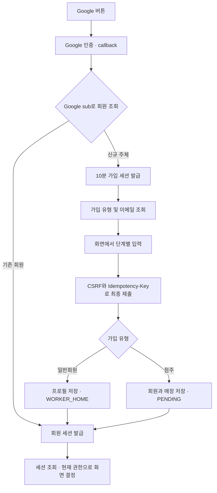

# 인증·인가 API 설계

이 문서는 구현 전 계약이다. 원본은 [`../openapi.yaml`](../openapi.yaml), 로컬 확인 방법은 [문서 서버 안내](README.md)이다. 실제 Google 로그인, API 저장, 세션/CSRF 검증, DB 권한 검증은 아직 구현되지 않았다.

## Figma 근거

2026-10-02에 Design 페이지의 실제 프레임과 텍스트를 확인했다.

| 화면 | 확인한 요구사항 | API 연결 |
| --- | --- | --- |
| [로그인·가입 192:5290](https://www.figma.com/design/ZaFHresnBXJ1h98Xl1AUDj?node-id=192-5290) | Google 계정으로 기존 로그인/신규 가입 | Google 시작·callback |
| [가입 유형 192:5299](https://www.figma.com/design/ZaFHresnBXJ1h98Xl1AUDj?node-id=192-5299) | 점주/일반회원 선택 | 가입 컨텍스트 조회, 역할별 최종 제출 |
| [일반회원 기본 정보 255:687](https://www.figma.com/design/ZaFHresnBXJ1h98Xl1AUDj?node-id=255-687) | 이름·Google 이메일·전화·생일·성별 | 일반회원 가입 본문 |
| [근무 경력 255:688/689/690](https://www.figma.com/design/ZaFHresnBXJ1h98Xl1AUDj?node-id=255-689), [현재 근무 506:4178](https://www.figma.com/design/ZaFHresnBXJ1h98Xl1AUDj?node-id=506-4178) | 신입/경력 분기, 업종·업무·선택 매장명·시작/종료 월 | careers, isCurrent, endMonth=null |
| [가능 시간 255:691/692](https://www.figma.com/design/ZaFHresnBXJ1h98Xl1AUDj?node-id=255-691) | 복수 요일, 30분 단위, 심야 입력 | availabilities, endsNextDay |
| [일반회원 확인·완료 255:693/694](https://www.figma.com/design/ZaFHresnBXJ1h98Xl1AUDj?node-id=255-693) | 최종 확인 후 프로필 등록 | 한 번의 최종 가입 요청 |
| [점주 기본 정보 335:1006](https://www.figma.com/design/ZaFHresnBXJ1h98Xl1AUDj?node-id=335-1006) | 성명·Google 이메일·연락처 | 점주 가입 본문 |
| [점주 매장 정보 220:401](https://www.figma.com/design/ZaFHresnBXJ1h98Xl1AUDj?node-id=220-401) | 월계1동 제한, 주소 검색·사업자 번호·매장 연락처, 중복 매장 안내 | store, 지역/중복 검증 |
| [점주 확인 335:1007](https://www.figma.com/design/ZaFHresnBXJ1h98Xl1AUDj?node-id=335-1007), [승인 대기 335:1008](https://www.figma.com/design/ZaFHresnBXJ1h98Xl1AUDj?node-id=335-1008) | 운영자 확인 전 초대·공고·매뉴얼 등 운영 제한 | PENDING 상태와 매장별 권한 |

## API 목록

| Method | Path | 목적 |
| --- | --- | --- |
| GET | `/api/auth/google` | Google 인증 화면으로 302 이동 |
| GET | `/api/auth/google/callback` | Google 인증 검증, 기존 회원/최초 가입 분기 |
| GET | `/api/auth/registration` | Google 이메일과 선택 가능한 가입 유형 조회 |
| GET | `/api/auth/csrf` | 현재 회원/가입 세션의 CSRF 토큰 조회 |
| POST | `/api/auth/registrations/workers` | 일반회원 프로필 저장과 가입 완료 |
| POST | `/api/auth/registrations/owners` | 점주 가입 및 최초 매장 승인 신청 |
| GET | `/api/auth/session` | 현재 사용자·역할·매장 승인·권한 조회 |
| POST | `/api/auth/logout` | 현재 브라우저의 회원/가입/OAuth 세션 종료 |

## 화면에 없는 설계 제안

- 인증은 서버가 Google authorization code를 교환하는 OIDC 흐름으로 정의한다. 검증된 Google `sub`를 식별 키로 사용하며 이메일이 같다는 이유로 계정을 자동 연결하지 않는다. Google scope는 `openid email profile`이다.
- 브라우저 `/api` 동일 출처 프록시와 서버 저장 opaque HttpOnly 세션 쿠키를 제안한다. 프론트에 JWT나 Google token을 전달하지 않는다. 회원 세션은 유휴 24시간/절대 7일, 가입 세션은 고정 10분, OAuth 트랜잭션은 5분이다. 이 수치는 제품 확정 정책이 아니다.
- Google state/nonce와 브라우저 트랜잭션 바인딩을 검증한다. 쿠키의 Secure 속성은 운영 HTTPS에서 필수이며 로컬 HTTP에서만 생략한다. Domain을 생략한 host-only 쿠키, SameSite=Lax를 사용한다.
- 변경 요청은 synchronizer CSRF token과 정확한 허용 Origin을 함께 검증한다. Google callback은 일회용 state가 해당 검증을 담당한다. CORS wildcard credentials를 허용하지 않는다.
- 입력 단계는 프론트에서 유지하고 마지막 확인에서만 한 번에 저장한다. 가입 초안의 서버 저장/중간 PATCH는 이번 계약에 없다.
- 최종 제출은 UUID Idempotency-Key를 요구한다. Google 주체·경로·정규화 본문과 묶어 24시간 기록하고 중복 제출을 방지한다. 성공 후 응답을 잃었으면 회원 세션으로 같은 요청을 재시도한다. 쿠키까지 없으면 Google 재로그인으로 같은 주체를 확인해야 한다.
- 업종 코드 4종, 입력 길이와 배열 최대 개수는 제안이다. 실제 프론트 선택지와 맞추며, 최대 경력 20개·가능 시간 그룹 100개를 둔다.
- callback의 `__auth/session`, `__auth/signup`, 오류 복귀 경로는 프론트 연동 시 확정한다. 운영 origin은 서버 설정을 쓰고 사용자가 지정한 외부 returnUrl은 받지 않는다.
- 승인 거절/재신청, 최소 연령, 약관 동의/버전 관리, 회원 탈퇴, 계정 연결, 여러 역할 겸임은 후속 제품 결정이 필요하다. 화면에 없으므로 해당 API를 추가하지 않았다.

인증 흐름은 [Google Web Server OAuth 가이드](https://developers.google.com/identity/protocols/oauth2/web-server), ID token 확인은 [Google OpenID Connect](https://developers.google.com/identity/openid-connect/openid-connect), CSRF 계약은 [OWASP CSRF 가이드](https://cheatsheetseries.owasp.org/cheatsheets/Cross-Site_Request_Forgery_Prevention_Cheat_Sheet.html)를 참고했다.

## 인가 경계

| 주체 | 허용 | 제한 |
| --- | --- | --- |
| 비로그인 | Google 시작·callback | 가입, 세션 조회, 회원 API |
| 가입 전 Google 인증 | 가입 컨텍스트·CSRF 조회·최종 가입 | 공고 지원, 점주 운영 등 회원 API |
| WORKER | 공고 탐색·지원, 본인 프로필 | 타인의 프로필 수정, 점주 운영 |
| OWNER + PENDING 매장 | 본인의 매장 승인 상태 조회 | 매장 관리·근무자 초대·공고 운영·매뉴얼 운영 |
| OWNER + APPROVED 매장 | 해당 매장의 관리·초대·공고·매뉴얼 운영 | 다른 점주의 매장, 아직 승인되지 않은 다른 매장 |
| 정지 계정/폐기 세션 | 재로그인 안내 또는 차단 안내 | 모든 회원 API |

`role=OWNER`만으로 매장 운영을 허용하면 안 된다. 역할·리소스 소유·매장 승인 상태를 매 요청 서버에서 확인한다. 응답의 permissions/nextAction은 UI 힌트다. 일반회원의 업무 자료 열람은 별도 재직/대타 기간 권한으로 판단하며, 역할만으로 모든 매뉴얼을 열람할 수 없다. 실제 공고·매뉴얼·관리자 승인 API는 이번 명세에 포함하지 않는다.

## 유효성 검증과 실패 계약

Schema로 검사하는 항목: 필수 필드, 읽기 전용 Google 이메일/role/승인 상태의 요청 주입 거절, 휴대전화/우편번호/사업자 번호 형식, 실제 달력 날짜, 성별, 신입의 빈 careers/경력자의 1건 이상 careers, 현재 근무의 null 종료 월, 요일 중복, 30분 시각 형식, 승인 대기 권한 및 화면 이동의 일치.

서버 구현에서 추가로 검사하는 항목:

- 생년월일이 미래가 아닌지, 경력 연월이 현재 이하이고 종료가 시작 이상인지 확인한다.
- 가능 시간을 Asia/Seoul 주간 구간으로 변환해 `0 < 기간 <= 24시간`을 확인한다. 같은 요일뿐 아니라 SUN 심야→MON 구간도 중복을 거절한다. 끝과 시작이 맞닿은 구간은 중복으로 보지 않는다.
- 주소 검색 결과의 우편번호·주소 일치와 행정동 월계1동을 확인한다. 단순 주소 문자열 포함 검사로 지역을 확정하지 않는다.
- 사업자 번호와 Google sub의 DB unique 제약, 트랜잭션, 동시 idempotency 요청을 확인한다. 회원 생성과 프로필/최초 매장 저장은 함께 성공하거나 함께 rollback한다.
- 입력 문자열의 공백, 실제 업종 선택지, businessRegistrationNumber 검증 정책을 확인한다. 매장 소재지·운영 권한의 최종 승인은 운영자가 처리한다.

| Status | 대표 코드 | 클라이언트 처리 |
| --- | --- | --- |
| 400 | OAUTH_STATE_INVALID, OAUTH_CODE_INVALID, INVALID_REQUEST | 로그인 다시 시작 또는 요청 형식 수정 |
| 401 | SESSION_EXPIRED, REGISTRATION_REQUIRED, GOOGLE_IDENTITY_INVALID | 입력값 보존 후 Google 인증 재시작/가입 진행 |
| 403 | CSRF_INVALID, ACCOUNT_SUSPENDED, FORBIDDEN, ALREADY_REGISTERED | CSRF 재조회 또는 역할/계정 차단 안내 |
| 409 | STORE_ALREADY_REGISTERED, ALREADY_REGISTERED, IDEMPOTENCY_KEY_REUSED | 자동 재시도 대신 중복/권한 문의 안내 |
| 422 | VALIDATION_ERROR, STORE_OUTSIDE_SERVICE_AREA | fieldErrors를 해당 입력칸에 표시 |
| 429 | RATE_LIMITED | Retry-After 이후 재시도 |
| 502 | GOOGLE_UNAVAILABLE | Google 인증을 처음부터 다시 시도 |
| 500 | INTERNAL_ERROR | 입력값 유지, 같은 key로 재시도 또는 requestId 문의 |

## 검증 범위

`npm run check`는 OpenAPI 구조·참조 lint, 요청/응답 예시와 정상/경계 입력 Schema, 승인 대기 응답, 문서 서버의 조회/오류/파일 접근 경계를 검증한다. Google redirect의 정상 성공 응답은 302여서 **해당 두 operation만** 2XX lint 요구에서 제외했다. 예시 및 나머지 규칙은 유지한다.

실제 Google 인증, 세션 만료/폐기, DB 중복/rollback, 주소 판정, 연월 순서/시간 중첩은 구현 후 통합 테스트가 필요하다. 현재 테스트 통과를 이러한 기능의 구현 완료로 해석하면 안 된다.
