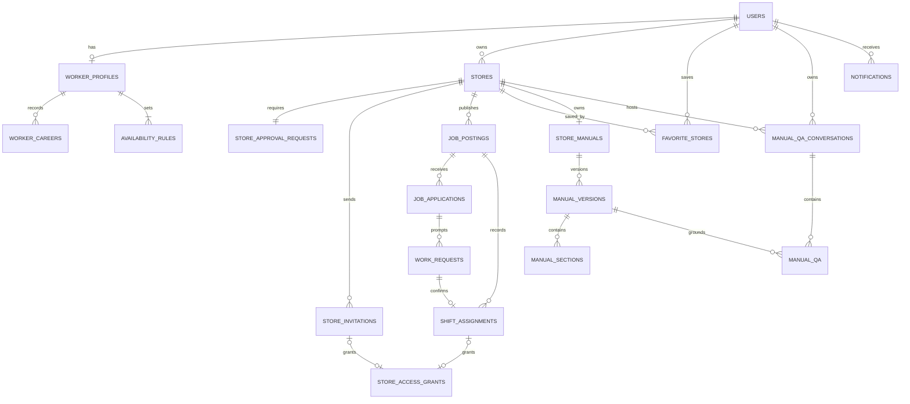

# 지단 MVP ERD

Figma의 입력·조회·상태 흐름과 OpenAPI를 연결한 **구현 전 관계형 데이터 설계**다. DB 마이그레이션이나 API 구현 완료를 뜻하지 않는다.

2026-10-05 사용자 결정에 따라 **근무 요청 수락 시 공고 자동 마감, 근무 시작 전 확정 철회 시 모집 재개**를 우선 반영했다. 나머지 충돌은 [OpenAPI 0.9.0](https://github.com/2026-KW-HACKATHON/29_Jidan/blob/531cfe0/back-end/openapi.yaml)과 [API PR #91](https://github.com/2026-KW-HACKATHON/29_Jidan/pull/91)을 기준으로 정합화했다. ERD는 [PR #95](https://github.com/2026-KW-HACKATHON/29_Jidan/pull/95)에서 별도 검토하며 두 브랜치의 선후 병합과 관계없이 이 계약을 구현 기준으로 사용한다.

접근 권한의 초대/확정 근무 출처는 각각 선택 관계이며, 두 FK 중 정확히 하나만 지정하는 XOR 제약을 함께 적용한다. 둘 다 없거나 둘 다 있는 접근은 허용하지 않는다. 상세 제약은 [매장 접근](access.md)을 따른다.

## 상세 ERD

| 흐름 | 문서 | 주요 테이블 |
| --- | --- | --- |
| Google 로그인·가입 유형 | [인증 주체](auth.md) | users |
| 기본 정보·경력·가능 시간 | [일반회원 프로필](worker.md) | worker_profiles, worker_careers, availability_rules, availability_days |
| 점주 매장 등록·운영 승인 | [매장 승인](store.md) | stores, store_approval_requests |
| 초대·정기/임시 자료 접근 | [매장 접근](access.md) | store_invitations, store_access_grants |
| 대타 공고·지원·요청·확정 | [대타 공고](jobs.md) | job_postings, job_applications, application_careers, work_requests, shift_assignments, application_selection_effects |
| 관심 매장 | [관심 관계](favorite-store.md) | favorite_stores |
| AI 인터뷰·검토·사진·게시 | [업무 매뉴얼](manual.md) | store_manuals, manual_versions, manual_shifts, manual_sections, manual_steps, manual_media, manual_photo_attachments, interview_turn_photos, interview_question_sets, interview_intents, interview_sessions, interview_session_intents, interview_intent_reviews, interview_review_confirmations, interview_probe_batches, interview_turns, interview_evaluations, manual_review_issues, manual_issue_acknowledgements |
| 질문·답변별 평가와 추가 질문 | [AI 인터뷰 실행 흐름](ai-interview-flow.md) | 질문 하나 → 답변 하나 → Jev 판단, depth 0~5 |
| 근무자 대화·질문·인용 | [AI 업무 질문](qa.md) | manual_qa_conversations, manual_qa, manual_qa_citations, qa_media, manual_qa_photos |
| 점주·일반회원 알림 | [앱 알림](notification.md) | notifications |

## 이번 정합화에서 확정한 기준

- User·Worker·Store/승인의 기존 기본 관계를 유지한다. 사용자당 WORKER/OWNER 단일 역할, 매장당 점주 한 명, 최초 승인 신청 한 건이 현재 범위다.
- 초대 링크는 생성 후 7일, 접근 종료일은 선택 값이다. 거절 이력과 재전송 토큰 교체를 지원하고 수락·기한·수동 종료를 분리한다.
- 재지원은 새 지원서와 제출 당시 이름·나이·경력 snapshot을 만든다. 근무 요청은 min(요청+1시간, 근무 시작)에 만료하며 유효 대기 요청은 공고당 하나다.
- 수락 시 CLOSED/closed_at 기록, 시작 전 확정 철회 시 RECRUITING/closed_at=NULL 복구. 확정 이력은 삭제하지 않고 활성 확정만 하나로 제한한다. 철회 시 그 요청 때문에 바뀐 지원만 복구한다.
- 공고/근무 요청/지원 상태는 OpenAPI 용어와 맞춘다. 수치형 경력 기준처럼 의도적으로 다른 저장 표현은 도메인 문서에 API 매핑을 명시한다. API 상태가 조합/시간으로 계산 가능하면 동일한 status 컬럼을 중복 저장하도록 강제하지 않는다.
- 인터뷰의 추가 질문도 한 개씩 생성·답변·평가한다. depth 5 부족은 NEEDS_DETAIL을 유지하고 바로 다음 인텐트로 이동한다. 인텐트별 검토와 최종 초안의 revision·확인 이력을 구분한다.
- 부족 항목은 최종 점주 확인만으로 게시할 수 있다. 미확정 필드는 공개 설명과 함께 남기고 게시본·당시 질문 근거는 불변 보존한다.
- 매뉴얼 업로드 자산과 사진 첨부를 분리한다. 근무자 Q&A는 본인 대화·질문·입력·인용을 보존하고 현재 자료 접근을 매번 확인한다.
- 관심 관계와 알림 typed target을 보완한다. 알림은 개별 읽음이며 모두 읽음 화면을 일괄 변경 API로 해석하지 않는다.

## 물리 스키마와 구현 책임

- 도식의 uuid는 논리 타입이다. MySQL의 BINARY(16)/CHAR(36), 문자열 길이·collation, nullable 컬럼, FK 삭제 정책, 인덱스와 마이그레이션은 구현 단계에서 정한다. 기록을 보존해야 하는 참조에는 무조건적인 cascade 삭제를 적용하지 않는다.
- 저장 시각은 UTC, 근무 날짜·요일 계산은 Asia/Seoul이다. 접근·요청 기한은 끝 시각을 제외한다. API startAt/endAt, 상태·건수·권한·화면 phase는 기존 행에서 계산할 수 있으며 별도 테이블을 요구하지 않는다.
- revision은 같은 리소스의 변경 경쟁을 막는 값이고 게시 버전 번호와 다르다. 상태 전이·지원 복구·접근 생성/종료·알림 outbox는 공고 또는 매뉴얼의 트랜잭션 경계로 묶는다. 외부 AI·메일 실행 동안 DB 트랜잭션을 열어 두지 않는다.
- 서버 세션/OAuth, 멱등성 결과, 작업 큐·전사·자동 재시도·fallback, outbox의 저장 매체와 운영 스키마는 공통 영속성 설계에서 정한다. 응답을 다시 조회해야 하는 처리 상태·입력·결과는 내구성 있게 저장하되, endpoint마다 새 도메인 테이블을 만들 필요는 없다.
- nullable 키의 UNIQUE 동작, 활성 지원/확정의 중복 차단, 같은 매장/버전/인텐트 귀속, snapshot 내부 참조는 DB 제약과 서비스 검증을 함께 설계한다. 문서 정합성 검사가 실제 DB 경합·rollback 검증을 대신하지 않는다.

## 후속 결정과 범위

다중 역할·공동 관리·소유권 이전·승인 거절/재신청, 모집 인원 확대, 계정 삭제와 장기 보존은 현재 MVP 밖이다. 세션/멱등성/파일 보존 상한과 근무 중첩 차단 등 OpenAPI의 보완 설계는 구현 시 검증한다. 이미 결정된 재지원·요청 만료·심야 표현·토큰 교체·부족 항목 확인 발행을 미결정 항목으로 되돌리지 않는다.

Figma의 Design 화면을 주요 근거로 사용했고 Design System/Wireframe/Image Assets/IR Deck으로 용어와 범위를 확인했다. 화면 밖 정책은 사용자 결정 또는 OpenAPI 보완 계약으로 구분한다. 독립적인 정기/일반 일정·체크리스트 수행 기록·실제 급여 지급·AI 실행 구현은 이 ERD 작업에 포함하지 않는다.

## 구현 결정 기록 (#103)

기준 스키마(`app/db/models.py`, 마이그레이션 `0001`)를 만들며 정한 물리 결정이다. ERD 의미는 바꾸지 않았다.

| 항목 | 결정 |
| --- | --- |
| UUID | `CHAR(36)` 문자열(디버깅 용이성). PK·FK·생성 컬럼 모두 `CHAR(36)`으로 통일하고 FK와 참조 PK의 charset·collation 일치를 테스트로 고정. 서비스에서 `uuid4`로 생성 |
| 시각 | UTC `DATETIME(6)`, 애플리케이션에서는 timezone-aware UTC만 허용. 연결 시 `time_zone='+00:00'` |
| 근무 날짜·시간 | `work_date`(DATE)·`start_time`·`end_time`은 `Asia/Seoul` 현지 값, 심야는 `ends_next_day` |
| enum | `VARCHAR` + 이름 있는 `CHECK`. 이름 규칙은 `ck_/uq_/fk_/ix_/pk_` 접두사 |
| 대소문자 구분 컬럼 | MySQL 기본 collation(`utf8mb4_0900_ai_ci`)은 대소문자를 구분하지 않아 `role IN ('WORKER','OWNER')`가 `'worker'`를 통과시키고 UNIQUE가 `'Ab'`와 `'ab'`를 같은 값으로 본다. 그래서 enum 성격 CHECK 컬럼 전부(role·status·gender·experience_level·weekday·approval_status·work_part·payment_timing·previous_status)와 불투명 식별자 UNIQUE 컬럼(`users.google_sub`, `store_invitations.token_hash`)은 MySQL에서 `utf8mb4_0900_as_cs`로 정의한다(`app.db.types.cs_string`, SQLite는 원래 구분하므로 variant). `utf8mb4_bin`은 PAD SPACE라 `'WORKER '`가 CHECK를 통과하고 UNIQUE에서 `'a'`와 `'a '`가 충돌해 쓰지 않았다(`0900_as_cs`는 NO PAD). enum은 어떤 FK에도 쓰이지 않으므로 FK/PK collation 불일치가 생기지 않는다. **이메일(`users.google_email`, `registration_sessions.google_email`, `store_invitations.invited_email`)은 의도적으로 대소문자를 구분하지 않되 악센트는 구분하는 `utf8mb4_0900_as_ci`(NO PAD)로 정의**한다(`app.db.types.email_string`, 마이그레이션 `0036`). 초대 이메일은 대소문자만 다른 주소를 같은 사람으로 매칭해야 하고 소문자 정규화는 서비스 책임이다. 기본 `utf8mb4_0900_ai_ci`는 악센트·합자까지 접어 `'josé@'`와 `'jose@'`, `'straße@'`와 `'strasse@'`를 같은 주소로 보므로 다른 사람의 초대가 매칭될 수 있어 바꿨다. `as_ci`도 전각 문자(`'ｊｏｓｅ'`)와 폭 없는 문자(U+200B)는 같게 보므로 SQL 매칭은 바이트까지 비교하는 `app.email_match.email_is`를 계속 쓰고, 초대 생성은 앞뒤 ASCII 공백만 지운 뒤 출력 가능한 ASCII(U+0021~U+007E)가 아닌 글자가 있으면 422로 거절한다(OpenAPI `format: email`은 ASCII 주소). 이메일 컬럼에는 UNIQUE·FK가 없어 collation 변경이 제약 위반을 만들지 않는다. `CHAR(36)` UUID는 현행 유지: 서비스가 소문자 `uuid4`만 생성하고, 대소문자만 다른 id는 별개 행이 아니라 같은 행으로 해석되므로(별개 행으로 갈라질 수 없고 다른 소유자의 행에 닿지도 않음) 안전한 쪽의 차이다. 모델과 DB collation 일치는 `tests/test_collation.py`가 `information_schema`로 검증한다 |
| 삭제 정책 | 모든 FK는 기본(RESTRICT). cascade 삭제 없음 |
| 활성 유일성 | 활성 지원·확정·대기 요청은 생성 컬럼(`active_worker_id` 등)에 UNIQUE를 걸어 DB에서 중복을 막음. 공고당 유효 PENDING 요청의 직렬화는 공고 잠금과 서비스 검증으로 보완 |
| `users.name`·`phone_number` | NOT NULL. 가입 최종 확인에서 한 번에 저장하므로 부분 가입 행을 만들지 않는다는 해석 |
| 경력 `store_name` | `worker_careers`·`application_careers` 모두 NULL 허용. OpenAPI `Career.storeName`이 선택(required 아님, 있으면 `minLength 1`·`\S`)이고 [근무 정보 설계](../worker-profile-design.md)도 "지우려면 필드를 생략"이라 NOT NULL이면 저장할 수 없기 때문. 생략·빈 문자열·공백만 있는 값은 `NULL`, 값이 있으면 앞뒤 공백을 제거해 저장(ORM `normalize_optional_text`). DB `CHECK`(공백 판정은 아래 "공백·숫자 CHECK" 행)가 우회 쓰기를 막는다. API는 빈 문자열을 422로 거절하므로 서비스까지 도달하는 값은 생략 또는 비공백이다. 지원서 경력 스냅샷도 동일하게 `NULL`을 그대로 복사 |
| `stores.detail_address` | NULL 허용(ERD가 필수를 명시하지 않음) |
| 사업자 번호 | 하이픈을 제거한 ASCII 숫자 10자리만 저장. 하이픈 제거는 서비스 책임. `LENGTH = 10`은 SQLite에서 글자 수, MySQL에서 바이트 수라 `'가나다a'`(4글자·10바이트)가 MySQL에서만 통과하고 전각 숫자 10자(30바이트)는 SQLite에서만 통과했으므로 방언별 CHECK로 바꿨다(아래 행) |
| 공백·숫자 CHECK (SQLite·MySQL 동일 의미) | CHECK 이름은 같고 SQL 본문만 방언별이다(`app/db/checks.py`의 `DialectSql`, 마이그레이션 `0001`에 같은 문장을 고정). `stores.business_registration_number`는 SQLite `LENGTH(c) = 10 AND c NOT GLOB '*[^0-9]*'`, MySQL `CHAR_LENGTH(c) = 10 AND REGEXP_LIKE(c, '^[0-9]{10}$')`. 공백 판정(`job_applications.introduction`, 경력 `store_name`)은 `TRIM(x) <> ''`를 버렸다. `TRIM`은 두 DB 모두 U+0020만 지우므로 탭·개행·NBSP·전각 공백만 있는 값이 통과했고, MySQL 기본 collation은 폭 없는 공백·제어 문자를 빈 문자열과 같게 봐서 그런 값만 MySQL이 거절하는 차이도 있었다. 이제 SQLite `TRIM(x, char(<Unicode White_Space 코드포인트>)) <> ''`, MySQL `REGEXP_LIKE(x, '[^[:space:]]')`로 둘 다 "공백이 아닌 글자가 하나 이상"을 요구한다(두 집합이 U+0000~U+30FF 전 구간에서 같음을 확인). 폭 없는 공백(U+200B)·제어 문자는 두 DB 모두 내용으로 본다. MySQL은 `REGEXP`를 `regexp_like()`로 저장하므로 처음부터 그 형태로 쓴다. 모델 CHECK와 DB의 일치는 `tests/test_schema_drift.py`가 방언별로 비교한다 |
| 남은 SQLite↔MySQL 차이 | 아래 표 |

**남은 SQLite↔MySQL 차이** (스키마로 맞추지 않고 서비스 책임으로 둔 것)

| 항목 | 차이 | 판단 |
| --- | --- | --- |
| 경력 `start_month`·`end_month` 형식 | DB는 `'YYYY-MM'` 형식을 검사하지 않는다(문자열 `VARCHAR(7)`). 형식이 맞는 값끼리의 `start_month <= end_month` 비교는 두 DB에서 같다. 형식이 틀린 값은 `'2024-1' < '2024-02'` 같은 사전식 순서가 되고, MySQL 기본 collation에서는 U+200B 같은 무시되는 글자가 붙은 값을 같은 값으로 본다(SQLite는 다른 값) | 서비스(API 스키마 `YYYY-MM` 검증)가 형식·미래 월을 막는다. DB 형식 CHECK는 ERD에 없는 새 제약이고 방언별 월 범위 표현이 커서 이번 범위에서 제외 |
| 경력 `industry`·`duties`, 이름 등 일반 문자열 | MySQL 기본 collation은 대소문자·악센트를 구분하지 않고 `=`·`UNIQUE`가 그렇게 동작한다. 해당 컬럼에는 UNIQUE·CHECK 비교가 없다 | 영향 없음 |
| `TIME` 소수초 | MySQL `TIME`은 소수초를 반올림해 저장하고 SQLite는 문자열 그대로 둔다 | 서비스가 30분 단위(소수초 없음)만 허용하므로 문서화만 한다 |
| 다른 방언 차이 가능성이 있는 CHECK | 나머지 CHECK는 정수 비교·`IN (enum)`·NULL 일치·시각 비교뿐이다. enum 대소문자는 `cs_string`으로 맞췄고, 시각은 UTC `DATETIME(6)` 비교다 | 점검 결과 차이 없음 |
| 서비스 검증으로 남긴 것 | `users.role`과 FK 대상 일치, 같은 매장 일치, 시간 중첩, 경력·가능 시간 개수 상한, 30분 단위, 미래 월 금지, 초대 이메일 소문자 정규화 |
| 이번 범위 밖 | 세션·OAuth 상태·멱등성(#104), 알림 outbox(#116), 관심 매장(#117), 매뉴얼·인터뷰·Q&A(#118~#121) 테이블. 이후 리비전은 `0001` 뒤에 한 줄로 추가 |
