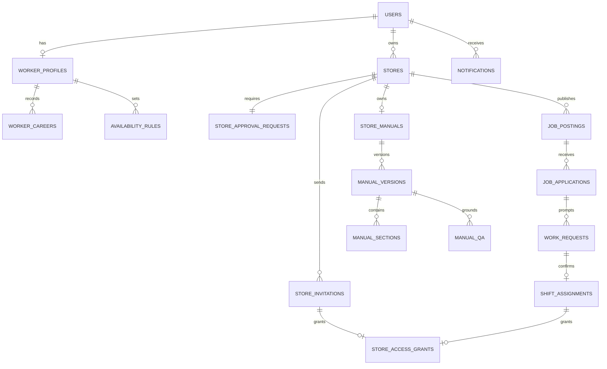

# 지단 MVP ERD

Figma의 `Design`, `Design System`, `IR Deck`, `Image Assets`, `Wireframe` 5개 페이지 구조를 확인하고, 실제 입력·조회·상태 전이가 있는 `Design` 화면을 중심으로 작성한 **구현 전 관계형 데이터 설계**다. Figma 확인은 2026-10-03 기준이며, AI 인터뷰의 필수 질문·Jev 판단·추가 질문 흐름은 2026-10-05 사용자 설명을 반영했다. DB 마이그레이션이나 API 구현 완료를 뜻하지 않는다.

## 상세 ERD

| 흐름 | 문서 | 주요 테이블 |
| --- | --- | --- |
| Google 로그인·가입 유형 | [인증 주체](auth.md) | `users` |
| 기본 정보·경력·가능 시간 | [일반회원 프로필](worker.md) | `worker_profiles`, `worker_careers`, `availability_rules`, `availability_days` |
| 점주 매장 등록·운영 승인 | [매장 승인](store.md) | `stores`, `store_approval_requests` |
| 초대·정기/임시 자료 접근 | [매장 접근](access.md) | `store_invitations`, `store_access_grants` |
| 대타 공고·지원·요청·확정 | [대타 공고](jobs.md) | `job_postings`, `job_applications`, `application_careers`, `work_requests`, `shift_assignments` |
| AI 인터뷰·점주 게시·근무자 질의 | [업무 매뉴얼](manual.md) | `store_manuals`, `manual_versions`, `manual_shifts`, `manual_sections`, `manual_steps`, `manual_media`, `interview_question_sets`, `interview_intents`, `interview_sessions`, `interview_session_intents`, `interview_probe_batches`, `interview_turns`, `interview_evaluations`, `manual_qa`, `manual_qa_citations` |
| 필수 질문·답변 평가·추가 탐문 | [AI 인터뷰 실행 흐름](ai-interview-flow.md) | 질문·답변·추가 탐문의 진행 순서 |
| 점주·일반회원 알림 | [앱 알림](notification.md) | `notifications` |

## 범위와 설계 기준

- `Design`의 가입, 매장 승인 대기, 근무자 프로필, 초대/접근 종료, 공고/지원/근무 확정, 매뉴얼 작성/게시/조회/질의응답, 알림 화면을 영속 데이터로 연결했다. `Design System`은 컴포넌트 사용 설명, `Wireframe`은 초기 흐름, `Image Assets`는 시각 자산, `IR Deck`은 MVP 경계 확인에 사용했다. 장식용 노드와 화면 상태별 복제 프레임은 별도 테이블로 만들지 않았다.
- [IR Deck의 MVP 범위](https://www.figma.com/design/ZaFHresnBXJ1h98Xl1AUDj?node-id=599-2390)는 매장 지식·온보딩과 대타 연결이다. 매장 검색·지역 광고·점주 구독·프랜차이즈 B2B 및 익명 집계는 이후 확장으로 표시되어 이 ERD에서 제외했다.
- PK/FK와 UNIQUE, 주요 상태·시간 제약을 상세 문서에 명시했다. 도식의 `uuid`는 논리 타입이다. MySQL에서 `BINARY(16)`/`CHAR(36)` 중 어떤 물리 표현을 쓸지는 마이그레이션 때 결정한다. 모든 저장 시각은 UTC, 근무 날짜·요일 계산은 `Asia/Seoul`을 기준으로 한다.
- Google/가입·프로필·매장 승인 필드는 별도 진행 중인 [인증 계약 #90](https://github.com/2026-KW-HACKATHON/29_Jidan/issues/90), [승인 계약 #92](https://github.com/2026-KW-HACKATHON/29_Jidan/issues/92)의 OpenAPI 초안과 대조했다. 공고·초대·매뉴얼·알림 API는 현재 계약에 없으므로 테이블·상태·고유 제약은 화면에 근거한 설계 제안이다.

## 구현 전 확인할 결정

1. 점주와 일반회원 겸임, 매장 공동 관리 권한 부여/회수, 매장 승인 거절·재신청 정책.
2. 대타 공고의 모집 인원 확대, 심야 근무 입력, 지원 철회 후 재지원과 여러 미응답 근무 요청의 처리 순서.
3. 초대 재전송 때 토큰 재사용 여부와 매뉴얼 사진·음성 원본의 보존/삭제 기간.
4. AI 답변의 근거 부족 처리, 매뉴얼 게시본 보존 기간, 알림 내비게이션 대상 삭제 시 동작.

이 결정들은 화면에 없는 정책이며 위 상세 문서의 제안 값을 실제 DB 스키마로 확정하기 전에 팀에서 검토해야 한다.
