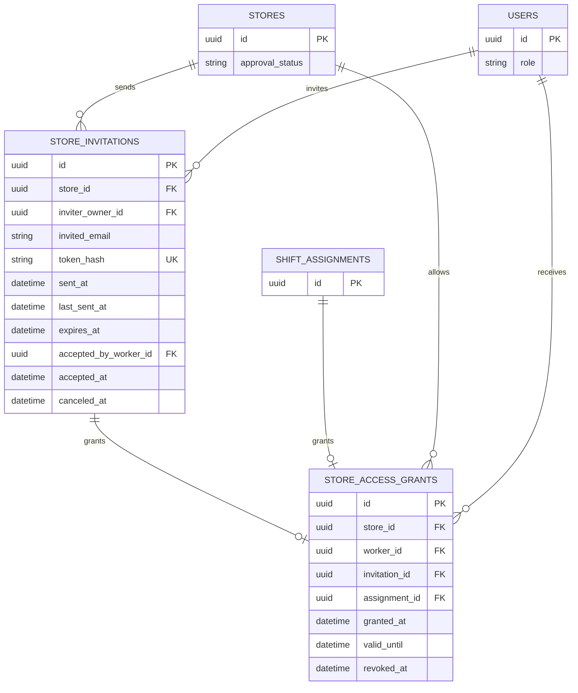

# 근무자 초대와 매장 자료 접근 ERD

## 테이블과 제약

| 테이블 | 핵심 제약 |
| --- | --- |
| `store_invitations` | 승인된 매장의 점주만 생성. `token_hash` UNIQUE, 원문 링크 토큰은 저장하지 않음. `expires_at=sent_at+7일`. 수락·취소·만료는 상호 배타적인 결과 |
| `store_access_grants` | `invitation_id`와 `assignment_id` 중 정확히 하나만 NOT NULL. 각각 UNIQUE. `worker_id`는 `role=WORKER`. `store_id`는 원본 초대 또는 확정 근무의 매장과 일치 |

- 초대 재전송은 기존 행의 `last_sent_at`만 갱신하고 `expires_at`은 유지한다. 취소되거나 만료된 링크는 수락할 수 없다. 수락 시 `accepted_by_worker_id`를 기록하고 같은 트랜잭션에서 상시 접근 권한을 만든다.
- 대타 근무가 확정되면 `shift_assignments`를 출처로 하는 임시 접근 권한을 즉시 만든다. `valid_until`은 해당 근무 종료 시각이고, 이 시각 뒤에는 매뉴얼·체크리스트·AI 질의응답 접근이 끝난다. 초대 수락 권한은 종료일이 없으며 점주의 접근 종료 시 `revoked_at`을 기록한다.
- 자료 조회는 사용자 ACTIVE 상태, 매장 승인 상태, `granted_at <= now`, `valid_until > now` 또는 NULL, `revoked_at IS NULL`을 매 요청 검사한다. 초대 이메일만으로 권한을 주지 않으며, 초대 수락 사용자의 검증된 계정과 초대 대상의 일치를 확인한다.
- 화면의 권한 카드는 매뉴얼·체크리스트·AI 질의응답 접근을 함께 보여준다. 항목별 독립 권한 스위치는 확인되지 않아 별도 권한 행을 만들지 않는다.
- 화면 근거: [근무자 초대](https://www.figma.com/design/ZaFHresnBXJ1h98Xl1AUDj?node-id=220-1333), [수락](https://www.figma.com/design/ZaFHresnBXJ1h98Xl1AUDj?node-id=248-1424), [초대 관리](https://www.figma.com/design/ZaFHresnBXJ1h98Xl1AUDj?node-id=506-4035), [재전송](https://www.figma.com/design/ZaFHresnBXJ1h98Xl1AUDj?node-id=506-4669), [근무 상태 상세](https://www.figma.com/design/ZaFHresnBXJ1h98Xl1AUDj?node-id=192-5251). 대타 출처는 [공고 ERD](jobs.md)를 따른다.
