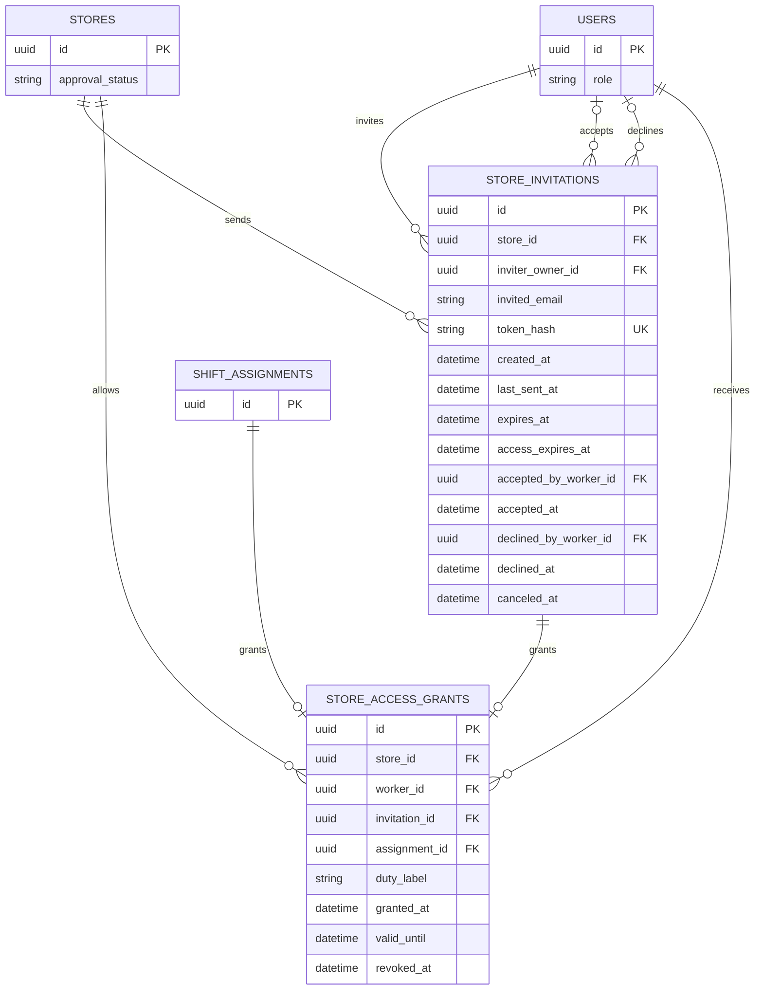

# 근무자 초대와 매장 자료 접근 ERD

## 테이블과 제약

| 테이블 | 핵심 제약 |
| --- | --- |
| `store_invitations` | 승인된 매장의 점주만 생성. `token_hash` UNIQUE, 원문 링크 토큰은 저장하지 않음. `expires_at=created_at+7일`. `access_expires_at`은 선택 자료 접근 종료 시각. 수락·거절·취소 결과는 상호 배타적이며 완료 시각과 처리 주체를 보존 |
| `store_access_grants` | `invitation_id`와 `assignment_id` 중 정확히 하나만 NOT NULL. 각각 UNIQUE. `worker_id`는 `role=WORKER`. `store_id`는 원본 초대 또는 확정 근무의 매장과 일치 |

- 초대 생성 시 선택한 `access_expires_at`은 생성 시각보다 미래이거나 NULL이다. 링크의 `expires_at`과 별개이며 PENDING에서 둘 중 먼저 도달한 기한부터 EXPIRED로 투영한다. 수락·거절·취소가 완료되면 시간이 지나도 원래 상태를 유지한다. 상태는 완료 시각과 기한에서 계산할 수 있어 별도 status 컬럼을 필수로 두지 않는다.
- 재전송은 `token_hash`, `last_sent_at`, 메일 outbox를 한 트랜잭션에서 교체하고 이전 링크를 무효화한다. `created_at`, `expires_at`, `access_expires_at`, 수신 주소는 유지한다. 큐 기록 실패는 전체 rollback하여 기존 링크가 유효하다. `last_sent_at`은 실제 수신 시각이 아닌 발송 요청 기록 시각이다.
- 수락 시 검증된 이메일이 일치하는 WORKER의 `accepted_by_worker_id`, `accepted_at`을 기록하고 같은 트랜잭션에서 REGULAR 접근을 만든다. `granted_at=accepted_at`, `valid_until=access_expires_at`이다. 거절은 `declined_by_worker_id`, `declined_at`만 기록하고 권한을 만들지 않는다. 동일 근무자의 재응답은 계약의 현재 기한·접근 상태를 재검증하고 최초 주체/시각을 보존한다. 종료된 접근은 재수락으로 복구하지 않는다.
- 대타 근무가 확정되면 `shift_assignments`를 출처로 하는 임시 접근 권한을 즉시 만든다. `valid_until`은 해당 근무 종료 시각이고, 이 시각 뒤에는 매뉴얼·체크리스트·AI 질의응답 접근이 끝난다. 초대 수락 권한은 선택 종료일 또는 NULL이며 점주가 더 일찍 종료하면 `revoked_at`을 기록한다. 종료 경계는 배타적이다.
- 초대 이메일은 앞뒤 공백 제거·소문자로 정규화하고 점/plus 별칭을 통합하지 않는다. 같은 매장·이메일의 유효 PENDING 초대와 이미 유효한 근무 접근을 생성/수락 트랜잭션에서 중복 검사한다. 시간 경과로 상태가 바뀌므로 `(store_id, invited_email)` 전체 이력 UNIQUE를 두지 않는다. 종료 후 재초대는 새 행으로 보존한다.
- 점주의 근무자 자료 접근 종료는 이 매장의 미종료 정기/대타 접근과 동일 이메일의 유효 PENDING 초대 취소·미발송 outbox 폐기를 원자 처리한다. 만료/종료 이력과 최초 `revoked_at`을 유지한다. 근무 확정 철회는 해당 확정의 TEMPORARY 접근만 종료하고 다른 접근은 유지한다. 근무 확정 자체를 취소하는 것과 자료 접근 종료는 별개다.
- 현재 유효 권한이 하나라도 있으면 자료 접근이 가능하다. 종료까지 24시간 이내 EXPIRING 및 근무자별 ACTIVE/EXPIRING/ENDED는 조회 시 계산하며 개별 권한 행을 중복 생성하지 않는다. 초대 수락과 대타 확정의 출처·매장·근무자 일치 및 직렬화는 FK와 서비스 트랜잭션으로 보장한다.
- 근무자 상세에는 담당 업무와 정기/대타 유형, 접근 시작일·만료일이 보인다. 유형은 초대/확정 근무 출처에서, 시작일은 `granted_at`에서 계산한다. 정기 근무의 `duty_label`은 현재 초대 화면에 입력칸이 없어 NULL 가능 필드로 두고 입력·수정 경로를 후속 결정한다. 대타 업무명은 연결된 공고에서 조회한다.
- 자료 조회는 사용자 ACTIVE 상태, 매장 승인 상태, `granted_at <= now`, `valid_until > now` 또는 NULL, `revoked_at IS NULL`을 매 요청 검사한다. 초대 이메일만으로 권한을 주지 않으며, 초대 수락 사용자의 검증된 계정과 초대 대상의 일치를 확인한다.
- 화면의 권한 카드는 매뉴얼·체크리스트·AI 질의응답 접근을 함께 보여준다. 항목별 독립 권한 스위치는 확인되지 않아 별도 권한 행을 만들지 않는다.
- 화면 근거: [근무자 초대](https://www.figma.com/design/ZaFHresnBXJ1h98Xl1AUDj?node-id=220-1333), [수락](https://www.figma.com/design/ZaFHresnBXJ1h98Xl1AUDj?node-id=248-1424), [초대 관리](https://www.figma.com/design/ZaFHresnBXJ1h98Xl1AUDj?node-id=506-4035), [재전송](https://www.figma.com/design/ZaFHresnBXJ1h98Xl1AUDj?node-id=506-4669), [근무 상태 상세](https://www.figma.com/design/ZaFHresnBXJ1h98Xl1AUDj?node-id=192-5251). 대타 출처는 [공고 ERD](jobs.md)를 따른다.
