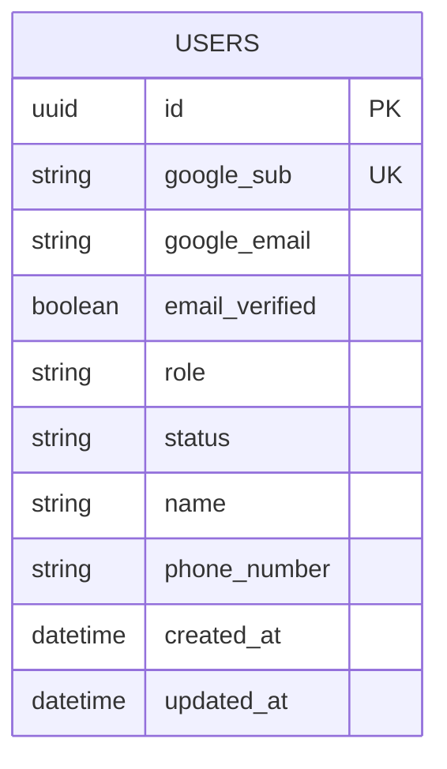

# 인증 주체 ERD

## 테이블과 제약

| 테이블 | 핵심 제약 | 근거와 판단 |
| --- | --- | --- |
| `users` | `id` PK, `google_sub` UNIQUE·NOT NULL. `role`은 `WORKER`/`OWNER`, `status`는 `ACTIVE`/`SUSPENDED` | [로그인·가입](https://www.figma.com/design/ZaFHresnBXJ1h98Xl1AUDj?node-id=192-5290), [가입 유형 선택](https://www.figma.com/design/ZaFHresnBXJ1h98Xl1AUDj?node-id=192-5299), [점주 기본 정보](https://www.figma.com/design/ZaFHresnBXJ1h98Xl1AUDj?node-id=335-1006) |

- Google `sub`만 계정 연결 키로 사용한다. Google 이메일은 검증된 표시·연락 정보이며 중복 이메일만으로 기존 계정을 합치지 않는다. `name`과 `phone_number`는 두 가입 유형의 공통 필드다.
- 역할은 현재 가입 화면의 단일 선택에 맞춰 사용자당 하나다. 다중 역할 겸임과 역할 변경은 별도 제품 결정이 필요하다.
- Google 토큰, 관리자 비밀번호 원문, 초대 토큰 원문은 이 테이블에 저장하지 않는다. 서버 세션·OAuth 트랜잭션·가입 재시도 기록의 저장 매체와 만료 정책은 [인증 계약 이슈 #90](https://github.com/2026-KW-HACKATHON/29_Jidan/issues/90) 구현 시 정한다.
- `status`, 생성·수정 시각과 UUID는 화면 필드가 아니라 서버 설계 제안이다. `google_email` 변경은 검증된 동일 `sub`로 로그인한 경우에만 반영한다.
