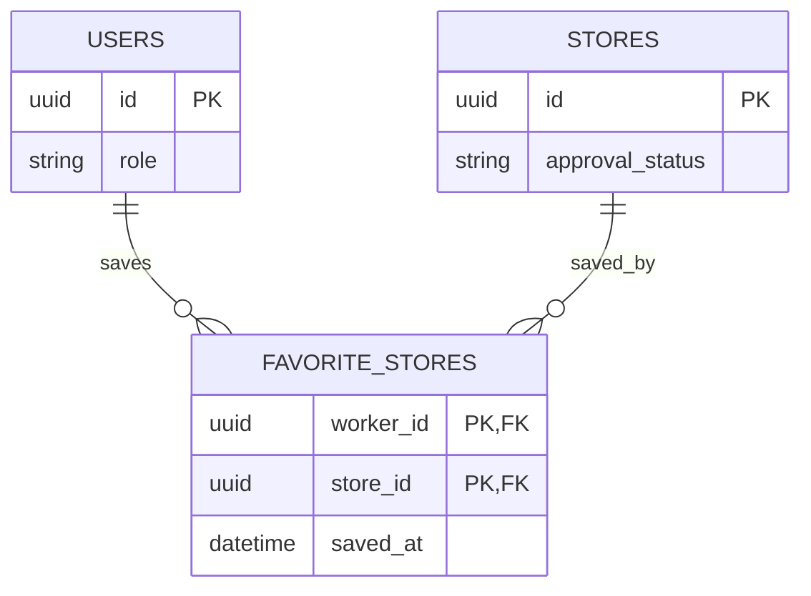

# 관심 매장 ERD

OpenAPI의 본인 관심 매장 등록·해제·목록과 홈 건수에 대응한다.

- `(worker_id, store_id)` 복합 PK로 같은 근무자의 중복 저장을 막는다. ACTIVE WORKER 본인과 APPROVED 매장만 등록할 수 있다.
- 같은 관계를 다시 PUT하면 최초 saved_at을 유지한다. DELETE는 관계를 제거하며 이미 없어도 성공한다. 등록과 삭제 경쟁은 같은 키의 트랜잭션/제약으로 처리한다.
- 자료 접근·초대·공고 지원·고용 관계를 만들거나 종료하지 않는다. 홈 건수와 목록은 같은 관심 관계에서 조회한다.
- 등록/해제 상세 화면은 없어 최소 보완 계약으로 제안된 영역이다. 본 문서는 해당 API를 영속 모델에 연결하며 별도 화면이나 기능을 추가하지 않는다.
