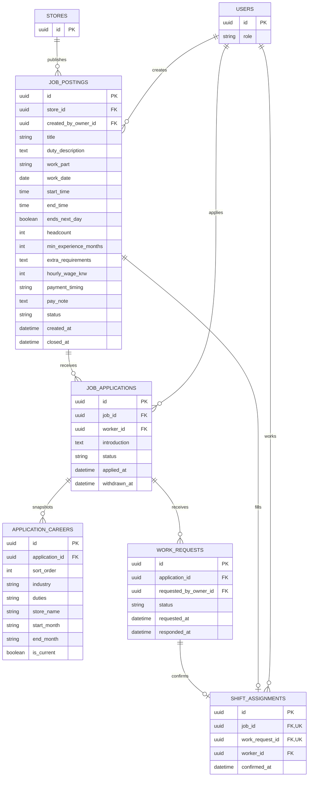

# 대타 공고·지원·근무 확정 ERD

## 테이블과 제약

| 테이블 | 핵심 제약 |
| --- | --- |
| `job_postings` | 승인된 매장에 속하고 `created_by_owner_id`는 해당 `stores.owner_id`. `status`는 `OPEN`/`CLOSED`. `headcount=1`은 현재 상세 화면의 MVP 조건. `min_experience_months`는 0/3/6/12, `payment_timing`은 `SAME_DAY`/`NEXT_DAY`/`NEGOTIATED` |
| `job_applications` | `(job_id, worker_id)` UNIQUE. `introduction`은 공백 제외 내용 필수·최대 500자. `status`는 `APPLIED`/`WITHDRAWN`; 같은 공고 재지원은 기존 행을 갱신하는 정책 제안 |
| `application_careers` | 지원 시점의 경력 복사본. `(application_id, sort_order)` UNIQUE. 신입은 0건 가능 |
| `work_requests` | 해당 `stores.owner_id`가 지원자에게 보낸 근무 요청 기록. `status`는 `PENDING`/`ACCEPTED`/`DECLINED`/`CANCELED`. 수락·거절 시 `responded_at` 기록 |
| `shift_assignments` | 수락된 요청에만 생성. 현 MVP는 `job_id` UNIQUE로 공고당 1명, `work_request_id` UNIQUE로 요청당 1건 확정 |

- 공고 등록 화면의 업무명·상세 설명·근무 파트·날짜·시간·경력·시급·지급 시점을 그대로 저장한다. 근무 파트는 `WEEKDAY_OPEN`, `WEEKDAY_CLOSE`, `WEEKEND_OPEN`, `WEEKEND_CLOSE`, `OTHER`로 매핑한다. `ends_next_day`는 심야 근무의 날짜 경계를 명확히 하기 위한 DB 제안이며 화면 입력 동작 확정이 필요하다.
- 지원자의 등록 경력은 지원 시점에 `application_careers`로 복사한다. 이후 프로필 수정으로 점주가 검토한 경력이 바뀌지 않게 하기 위한 설계 제안이다. 근무 가능 시간은 지원·확정 시 현재 프로필로 검사하고 별도 복사본은 두지 않는다.
- Figma의 지원자 상태 `Applied`/`Waiting`/`NoResponse`/`Confirmed`는 신청, 근무 요청, 확정 근무의 조합으로 계산한다. `NoResponse`는 `PENDING` 요청의 `requested_at` 이후 1시간 경과 표시·알림이며 자동 취소가 아니다. 1시간 후 다른 후보에게 요청하려면 기존 요청의 처리와 공고 수용 인원을 트랜잭션에서 함께 검사한다.
- 요청 수락 시 근무 확정, 공고 마감, [임시 매장 접근 권한](access.md)을 같은 트랜잭션에서 적용한다. 지원자 선정 없이 마감하면 `shift_assignments`가 생기지 않는다. 닫힌 공고는 신규 지원을 받지 않는다. 달력 일정은 확정 근무와 공고 일시에서 조회하며 별도 달력 테이블을 두지 않는다.
- 화면 근거: [공고 등록 업무](https://www.figma.com/design/ZaFHresnBXJ1h98Xl1AUDj?node-id=638-2597), [경험 조건](https://www.figma.com/design/ZaFHresnBXJ1h98Xl1AUDj?node-id=639-2712), [급여 조건](https://www.figma.com/design/ZaFHresnBXJ1h98Xl1AUDj?node-id=639-2775), [공고 상세](https://www.figma.com/design/ZaFHresnBXJ1h98Xl1AUDj?node-id=468-2992), [지원 소개](https://www.figma.com/design/ZaFHresnBXJ1h98Xl1AUDj?node-id=530-3183), [지원자 검토](https://www.figma.com/design/ZaFHresnBXJ1h98Xl1AUDj?node-id=639-2971), [1시간 미응답](https://www.figma.com/design/ZaFHresnBXJ1h98Xl1AUDj?node-id=698-2765), [근무 확정](https://www.figma.com/design/ZaFHresnBXJ1h98Xl1AUDj?node-id=698-2821), [선정 없이 마감](https://www.figma.com/design/ZaFHresnBXJ1h98Xl1AUDj?node-id=639-2895).
