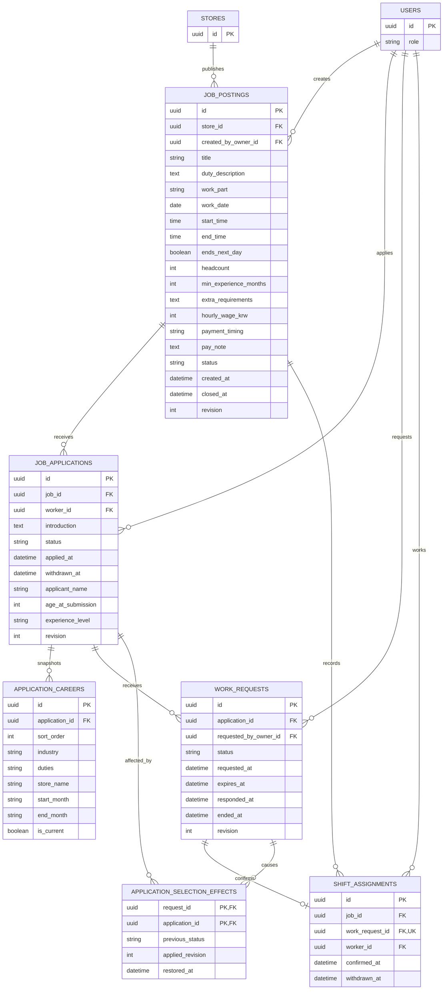

# 대타 공고·지원·근무 확정 ERD

## 테이블과 제약

| 테이블 | 핵심 제약 |
| --- | --- |
| `job_postings` | 승인된 매장의 현재 점주가 생성. `status=RECRUITING/CLOSED`, `headcount=1`, `revision>=1`. RECRUITING은 `closed_at IS NULL`, CLOSED는 마감 시각 필수. `min_experience_months=0/3/6/12`, `payment_timing=WORK_DAY/NEXT_DAY/NEGOTIABLE` |
| `job_applications` | 지원 시도마다 새 PK. 상태는 `APPLIED/REQUESTED/CONFIRMED/WITHDRAWN/NOT_SELECTED/COMPLETED`. `(job_id, worker_id)` 전체 이력 UNIQUE 금지. 현재 APPLIED/REQUESTED/CONFIRMED 지원은 같은 공고·회원당 최대 하나. `introduction`은 공백 제외 내용 필수·최대 500자. WITHDRAWN만 `withdrawn_at` 필수 |
| `application_careers` | 지원 시점의 경력 복사본. `(application_id, sort_order)` UNIQUE. 지원서의 `applicant_name`, `age_at_submission`, `experience_level`도 당시 값으로 불변 보존. NEW는 경력 0건, EXPERIENCED는 1~20건 |
| `work_requests` | `PENDING/ACCEPTED/DECLINED/EXPIRED/CANCELLED/CONFIRMATION_WITHDRAWN`. `expires_at=min(requested_at+1시간, 근무 시작)`. 공고당 유효 PENDING은 최대 하나. 수락·거절에 `responded_at`, 종료된 요청에 `ended_at` 기록. ACCEPTED는 수락으로 요청 대기가 끝난 시각이 ended_at이며 근무 종료 시각이 아님. 확정 철회 시 responded_at 보존, ended_at은 철회 시각 |
| `shift_assignments` | 수락 요청당 한 행(`work_request_id` UNIQUE). `job_id` 전체 이력 UNIQUE 금지. `withdrawn_at IS NULL`인 확정만 공고당 최대 하나. 근무 완료 이력도 유지. 확정 철회 시 해당 행의 withdrawn_at 기록, 과거 행을 삭제·재사용하지 않음 |
| `application_selection_effects` | `(request_id, application_id)` 복합 PK. 수락 때문에 NOT_SELECTED가 된 지원에 대해 원인 요청·직전 상태·적용 후 revision을 저장. 같은 공고 귀속을 검증하고 복구 시각은 한 번만 기록 |

## 수락·철회·재모집

- 사용자 확정: 수락은 요청 ACCEPTED, 지원 CONFIRMED, 다른 지원 NOT_SELECTED, 미결 요청 CANCELLED, 확정 근무·TEMPORARY 접근·알림 outbox 생성과 공고 RECRUITING→CLOSED를 같은 트랜잭션에서 처리한다. `closed_at=responded_at=confirmed_at`이다. 신규 지원/요청은 확정된 공고의 JOB_FILLED를 일반 CLOSED 오류보다 먼저 판정한다.
- 근무 시작 전(`now < startAt`) 점주의 확정 철회는 요청 CONFIRMATION_WITHDRAWN, 해당 확정 withdrawn_at 기록, 선택 지원 APPLIED 복구와 공고 CLOSED→RECRUITING 및 `closed_at=NULL`을 원자 처리한다. 해당 확정의 TEMPORARY 접근만 종료하고 활성 캘린더에서 제외한다. 이전 마감 시각은 기존 확정의 confirmed_at과 수락 이력에 보존한다. 정기 접근과 다른 대타 접근, 이미 종료된 접근의 최초 revoked_at은 유지한다.
- 다른 지원은 `application_selection_effects`에 기록된 원인·현재 NOT_SELECTED 상태·적용 revision이 일치할 때만 직전 상태로 복구한다. WITHDRAWN, 별도로 종료/변경된 지원, 다른 확정의 효과는 되살리지 않는다. 과거 요청을 재활성화하지 않고 새 requestId/key를 만든다.
- 정확히 근무 시작부터 확정 철회 불가. 근무 종료만으로 다시 열리지 않으며 지원만 COMPLETED로 조회/전환하고 요청 ACCEPTED 및 확정 이력을 보존한다. 수동 자료 접근 종료도 공고를 다시 열지 않는다.
- 선정 없이 수동 마감할 때는 유효 대기 요청 철회를 먼저 수행한다. 미확정 RECRUITING만 CLOSED로 바꾸고 현재 지원을 종료한다. 이미 CLOSED이면 최신 revision의 재요청은 시각·revision·확정·접근·일정 변경 없이 성공한다. 새 key의 오래된 revision은 충돌, 같은 key 재시도는 최초 결과다.

## 재지원·만료·조회와 동시성

- 신청 철회는 APPLIED/REQUESTED에서만 허용한다. 철회 후 새 key로 재지원하면 새 applicationId와 새 프로필 스냅샷을 만들고 과거 지원/요청/경력은 유지한다. 시작 전 모집 중·미확정 공고만 가능하다. 이전 성공 key 재사용은 과거 결과 재현이다.
- 정확히 expires_at부터 PENDING 요청은 EXPIRED로 투영하고 지원을 APPLIED로 복구한다. 배치 지연이 수락 기한을 연장하지 않는다. 거절·요청 철회·만료는 공고를 마감하지 않는다. 같은 후보에게 다시 요청할 때도 새 행을 생성한다.
- 공고→요청→지원→접근 순서의 잠금과 expectedRevision 검증으로 수락·철회·마감·재지원을 직렬화한다. 공고/지원/요청의 상태가 변하면 해당 revision을 증가시킨다. 활성 지원/확정의 유일성은 구현 시 NULL 허용 생성 키 UNIQUE 등 MySQL에서 가능한 제약과 공고 잠금을 함께 사용한다. 시간에 따라 유효성이 달라지는 PENDING은 기한 재검증과 직렬화가 필수다.
- API `minimumExperience=ANY/MONTHS_3/MONTHS_6/YEAR_1`은 저장값 0/3/6/12개월로 매핑한다. `recruitmentCount`는 headcount, description은 duty_description, hourlyPay는 hourly_wage_krw로 대응한다. 근무 파트는 `WEEKDAY_OPEN/WEEKDAY_CLOSE/WEEKEND_OPEN/WEEKEND_CLOSE/OTHER`다. 심야는 ends_next_day로 표현하고 서울 날짜·시간에서 startAt/endAt을 계산한다.
- 최소 경력은 안내 조건이며 미달만으로 지원을 막지 않는다. 가능 시간은 추천 순위와 matchesAvailability 계산에 사용하며 불일치만으로 지원을 차단하지 않는다. 확정 수락 시 본인의 다른 확정 대타와 실제 시간 중첩을 차단하고 인접 구간은 허용한다.
- 캘린더는 철회되지 않은 확정 근무와 공고 일시로 조회하며 별도 일정 테이블을 요구하지 않는다. 근무 완료 이력은 남고 자료 접근은 종료한다. eventId는 확정 ID 등 안정적인 식별자에 매핑한다. 공고가 재개되면 시작 전 탐색/추천과 신규 지원 대상이 된다.
- 제출 시 이름·나이·경력은 스냅샷이며 이후 프로필 변경으로 덮어쓰지 않는다. 생일·전화·이메일은 점주 지원서에 노출하지 않는다. FK로 연결되는 근무자 본인과 요청자 점주의 역할·매장 소유권은 서비스에서 검증한다.

- 화면 근거: [공고 등록 업무](https://www.figma.com/design/ZaFHresnBXJ1h98Xl1AUDj?node-id=638-2597), [경험 조건](https://www.figma.com/design/ZaFHresnBXJ1h98Xl1AUDj?node-id=639-2712), [급여 조건](https://www.figma.com/design/ZaFHresnBXJ1h98Xl1AUDj?node-id=639-2775), [공고 상세](https://www.figma.com/design/ZaFHresnBXJ1h98Xl1AUDj?node-id=468-2992), [지원 소개](https://www.figma.com/design/ZaFHresnBXJ1h98Xl1AUDj?node-id=530-3183), [지원자 검토](https://www.figma.com/design/ZaFHresnBXJ1h98Xl1AUDj?node-id=639-2971), [1시간 미응답](https://www.figma.com/design/ZaFHresnBXJ1h98Xl1AUDj?node-id=698-2765), [근무 확정](https://www.figma.com/design/ZaFHresnBXJ1h98Xl1AUDj?node-id=698-2821), [선정 없이 마감](https://www.figma.com/design/ZaFHresnBXJ1h98Xl1AUDj?node-id=639-2895).
