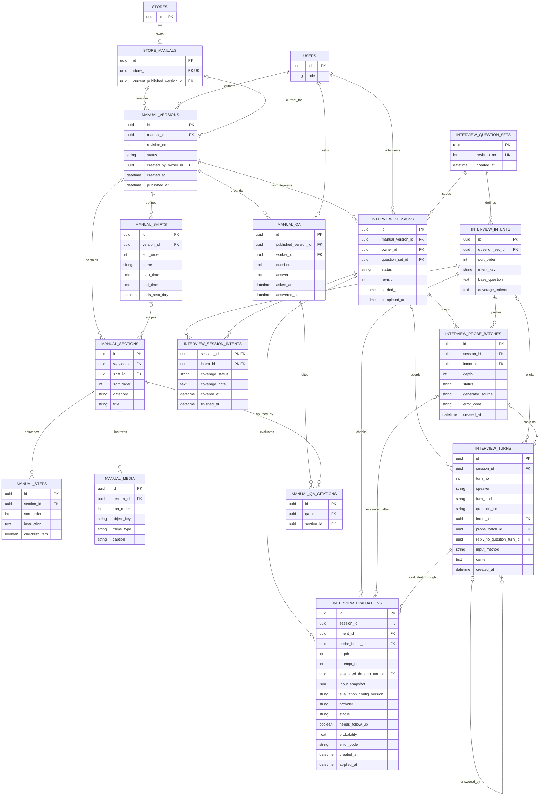

# 업무 매뉴얼·AI 인터뷰·질의응답 ERD

점주 인터뷰의 필수 질문·추가 탐문 분기는 [AI 인터뷰 실행 흐름](ai-interview-flow.md)을 따른다.

## 테이블과 제약

| 테이블 | 제약 |
| --- | --- |
| `store_manuals` | `store_id` UNIQUE. `current_published_version_id`는 같은 매뉴얼의 게시 버전만 참조 |
| `manual_versions` | `(manual_id, revision_no)` UNIQUE. `status`는 `DRAFT`/`PUBLISHED`. 초안은 `published_at IS NULL`, 게시본은 게시 시각 필수이며 게시 후 내용 불변 |
| `manual_shifts` | 버전별 오전·오후·야간 등 근무조와 시간. `(version_id, sort_order)` UNIQUE |
| `manual_sections` | `category`는 `COMMON_TASK`/`SHIFT_TASK`/`RULE`/`EQUIPMENT`. `shift_id`가 있으면 같은 버전에 속해야 함. `(version_id, sort_order)` UNIQUE |
| `manual_steps`, `manual_media` | 각 섹션 안에서 순서 UNIQUE. 사진은 파일 본문 대신 저장소 `object_key`와 선택 설명을 보관. 삭제 시 파일 정리 정책 필요 |
| `interview_question_sets`, `interview_intents` | 필수 질문 셋의 버전과 순서를 보관. 각 인텐트는 기본 질문과 확인할 정보의 기준을 가짐. `(question_set_id, sort_order)` 및 `(question_set_id, intent_key)` UNIQUE. 사용한 질문 셋은 수정하지 않고 새 버전을 생성 |
| `interview_sessions`, `interview_session_intents` | 세션 생성 시 `DRAFT` 버전에 연결하고 질문 셋 버전을 고정. 매뉴얼 게시 후에도 세션은 같은 버전을 참조해 작성 이력을 보존. 세션의 `status`는 `IN_PROGRESS`/`ERROR`/`COMPLETED`이며 `COMPLETED`에서만 `completed_at`을 기록. 시작할 때 질문 셋의 모든 필수 인텐트에 상태 행을 생성. 수집 상태는 `PENDING`/`NEEDS_DETAIL`/`COVERED`; 인텐트는 세션의 질문 셋에 속해야 함. `finished_at`은 해당 인텐트에서 다음 질문으로 이동한 시각이며, `covered_at`은 정보 수집 완료 시각. depth 5에서 수집이 부족하면 `NEEDS_DETAIL`로 검수중 표시하고 `finished_at`을 기록한 뒤 점주 확인 대기 없이 즉시 다음 인텐트로 이동. 마지막 인텐트면 초안 생성 준비로 이동. 부족 항목은 최종 초안 검토에서 점주 확인만으로 게시 가능하며 보완 답변은 필수가 아님 |
| `interview_probe_batches` | 같은 인텐트의 추가 질문 한 개에 대한 생성 단위. API batchId에 대응하며 READY마다 질문은 정확히 한 개. `depth`는 기본 질문 이후 1부터 시작하고 최대 5. `(session_id, intent_id, depth)` UNIQUE. `status`는 `GENERATING`/`READY`/`ERROR`; 재시도와 fallback이 모두 실패하면 `ERROR`와 오류 코드를 기록하고 세션도 `ERROR`로 표시. 인텐트는 세션의 질문 셋에 속해야 함 |
| `interview_turns` | AI 질문과 점주 답변을 순서대로 저장. `speaker`는 `AI`/`OWNER`, `turn_kind`는 `QUESTION`/`ANSWER`/`CORRECTION`/`OTHER`, AI 질문의 `question_kind`는 `BASE`/`PROBE`. `intent_id`는 세션의 질문 셋에 속해야 함. `BASE` 질문은 인텐트마다 한 번이고 묶음이 없으며, `PROBE` 질문은 `probe_batch_id` 필수이며 묶음과 질문의 세션·인텐트가 일치해야 함. 답변에 묶음 참조를 기록하면 원 질문과 같은 묶음을 참조. 점주 답변의 `reply_to_question_turn_id`는 같은 세션·인텐트의 AI 질문을 참조. 현재 질문 한 개의 답변을 저장할 때마다 즉시 누적 문맥으로 재평가. 답변은 질문당 한 개이며 재시도는 같은 답변을 재사용. 정정은 별도 CORRECTION 턴으로 보존. 답변 방식은 `VOICE`/`TEXT`, 저장 내용은 텍스트. `(session_id, turn_no)` UNIQUE |
| `interview_evaluations` | 기본 질문 답변 평가의 `depth`는 0이고 `probe_batch_id`는 NULL. 추가 질문 답변 평가는 해당 생성 단위의 `depth`와 `probe_batch_id`를 사용. Jev와 fallback 호출의 `provider`, `attempt_no`, 성공·실패 `status`, 판단값과 오류 코드를 기록. `(session_id, intent_id, depth, attempt_no)` UNIQUE. `probe_batch_id`가 있으면 평가와 묶음의 세션·인텐트·depth가 일치해야 함. `evaluated_through_turn_id`는 같은 세션·인텐트에서 평가에 포함한 마지막 점주 답변을 참조. `input_snapshot`은 실제 전달한 질문·답변의 ID와 텍스트, 인텐트·문맥 및 typed question을 보존. `evaluation_config_version`은 provider별 모델·질문 구성·판단 임계값을 포함한 불변 설정의 버전. 입력 범위와 재시도 규칙은 아래 실행 제약을 따름. 적용한 성공 결과의 `applied_at`을 기록하고 같은 depth의 결과는 한 건만 적용. 재시도·fallback까지 실패하면 세션을 `ERROR`로 표시 |
| `manual_qa`, `manual_qa_citations` | 질문에는 당시 게시 버전을 고정하고 출처 섹션은 같은 버전이어야 함. 답변 근거가 없는 경우 사용자에게 근거 부족을 알리는 정책 필요 |

- AI가 필수 질문 셋의 인텐트를 순서대로 확인 → 점주가 답변 → Jev가 추가 질문 필요 여부 판단 → 필요한 경우 같은 인텐트의 질문 한 개와 답변·평가를 depth별로 반복 → 모든 필수 인텐트를 진행한 뒤 매뉴얼 초안을 구조화 → 점주 수정·확인 → 게시 순서다. depth 5에서도 부족하면 해당 항목을 `NEEDS_DETAIL`(검수중)로 남기고 점주 확인 대기 없이 다음 인텐트로 이동한다. 마지막 항목도 초안 생성을 막지 않는다. 부족 항목 확인은 최종 초안 검토에서 수행하며 점주 확인만으로 게시할 수 있다. 기본 질문 문구는 문맥에 맞게 달라질 수 있으며 필수 인텐트는 모두 진행한다. 이 질문 셋은 점주의 암묵지를 수집하는 인텐트 레이어다. AI가 만든 초안은 `DRAFT`이고 근무자에게 공개하지 않는다. 게시 시 새 버전을 고정하고 `current_published_version_id`를 원자적으로 바꾼다. 이전 게시 버전과 그 출처는 당시 질의응답의 근거로 유지한다.

## 평가와 장애 복구의 실행 제약

- 평가 입력에는 현재 인텐트의 기본 질문부터 현재 depth까지 저장된 질문과 각 점주 답변을 순서대로 포함한다. 다른 인텐트의 답변을 문맥으로 사용하면 그 내용도 `input_snapshot`에 포함한다. 평가에 사용된 턴과 입력 스냅샷은 수정하지 않는다. 답변 정정은 CORRECTION 새 턴으로 보존한다. 완료 인텐트의 검토 정정은 기존 평가·현재 질문·depth를 바꾸지 않으며, 이후 예약하는 작업부터 새 검토 내용을 사용한다.
- 평가가 참조하는 묶음·마지막 답변과 세션·인텐트의 일치를 검증한다. 물리 구현에서는 복합 FK 또는 상태 갱신 트랜잭션 안의 서비스 검증으로 보장한다.
- 질문 생성과 평가 호출은 자동 재시도 후 fallback을 수행한다. 모두 실패하면 오류를 점주에게 표시하고 세션을 `ERROR`로 둔다. 저장된 질문·답변·평가 이력을 유지하며 인텐트나 depth를 이동하지 않는다. 재개 시 실패한 생성 또는 평가 작업부터 수행하고 성공 시 세션을 `IN_PROGRESS`로 복구한다.
- 질문 생성 재시도는 같은 묶음과 depth를 사용한다. 생성한 질문 한 개의 저장과 생성 단위의 `READY` 전환은 하나의 트랜잭션으로 처리한다. `READY` 이전의 질문은 제시하지 않으며, 질문을 미리 여러 개 공개하거나 묶음 전체의 답변을 기다리지 않는다. depth는 새로운 추가 질문 생성 단위를 시작할 때만 증가하고 재시도에서는 증가하지 않는다.
- 평가 재시도는 저장된 답변과 입력 스냅샷을 재사용한다. fallback이 다른 입력 형식을 요구하면 의미상 같은 질문·답변을 변환하고, 그 시도의 실제 입력과 설정 버전을 별도 평가 행에 보존한다. 이전 `attempt_no`를 덮어쓰지 않고 증가시킨다.
- 세션 `revision`은 질문 진행/처리 상태가 바뀔 때 증가하며 expectedRevision으로 검사한다. phase는 현재 질문·처리·인텐트 진행에서 투영한다. 같은 세션에 공개된 미답변 질문은 최대 한 개다.
- 성공한 평가의 `applied_at` 기록과 인텐트 상태·다음 묶음 생성 예약 또는 다음 인텐트 이동은 하나의 트랜잭션으로 처리한다. 이미 적용한 평가를 다시 적용하지 않는다. 같은 세션의 동시 요청도 같은 depth에서 중복 묶음이나 중복 진행을 만들지 않도록 직렬화한다.

- 매뉴얼 조회와 AI 질의응답은 [매장 접근 권한](access.md)을 확인한 근무자에게 현재 게시 버전만 제공한다. 질의응답 저장 행은 당시 버전을 가리켜 이후 수정에도 출처가 달라지지 않는다.
- 사진은 공통 업무·규정 등 연결된 섹션에 붙인다. IR 자료에는 영상 보완 언급도 있지만 현재 상세 화면은 사진 첨부를 구체화했으므로 영상 처리·보존 정책은 후속 결정이다. 음성 원본의 장기 보관도 화면에서 확정되지 않아 이 ERD에는 전사 텍스트만 둔다.
- 화면 근거: [매뉴얼 작성 시작](https://www.figma.com/design/ZaFHresnBXJ1h98Xl1AUDj?node-id=560-4170), [AI 인터뷰](https://www.figma.com/design/ZaFHresnBXJ1h98Xl1AUDj?node-id=330-2713), [최종 검토·게시](https://www.figma.com/design/ZaFHresnBXJ1h98Xl1AUDj?node-id=330-2757), [사진 첨부](https://www.figma.com/design/ZaFHresnBXJ1h98Xl1AUDj?node-id=777-2979), [업무 목록](https://www.figma.com/design/ZaFHresnBXJ1h98Xl1AUDj?node-id=330-2819), [단계별 상세](https://www.figma.com/design/ZaFHresnBXJ1h98Xl1AUDj?node-id=624-2603), [AI 질의응답](https://www.figma.com/design/ZaFHresnBXJ1h98Xl1AUDj?node-id=330-2914), [IR Deck의 AI Rule Book](https://www.figma.com/design/ZaFHresnBXJ1h98Xl1AUDj?node-id=597-2700).
