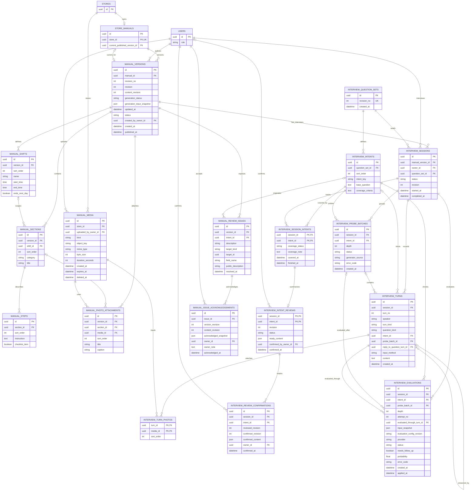

# 업무 매뉴얼·AI 인터뷰·질의응답 ERD

점주 인터뷰의 필수 질문·추가 탐문 분기는 [AI 인터뷰 실행 흐름](ai-interview-flow.md)을 따른다. 근무자 대화·질문·사진·인용은 [업무 질문 ERD](qa.md)를 따른다.

## 테이블과 제약

| 테이블 | 제약 |
| --- | --- |
| `store_manuals` | `store_id` UNIQUE. `current_published_version_id`는 같은 매뉴얼의 게시 버전만 참조 |
| `manual_versions` | `(manual_id, revision_no)` UNIQUE. revision_no는 게시 버전 번호, revision은 같은 초안의 변경 검사용 값, content_revision은 내용/부족 항목 정의의 변경 세대로 구분. 확인·게시만으로 content_revision을 증가시키지 않음. 매뉴얼당 활성 DRAFT는 최대 한 개. generation_status는 `NOT_STARTED/RUNNING/READY/ERROR`이며 API의 생성 상태를 표현. `status`는 `DRAFT`/`PUBLISHED`. 초안은 `published_at IS NULL`, 게시본은 게시 시각 필수이며 게시 후 내용 불변 |
| `manual_shifts` | 버전별 오전·오후·야간 등 근무조와 시간. `(version_id, sort_order)` UNIQUE |
| `manual_sections` | `category`는 `COMMON_TASK`/`SHIFT_TASK`/`RULE`/`EQUIPMENT`. `SHIFT_TASK`만 shift_id 필수이며 같은 버전이어야 함. 나머지 category는 shift_id NULL. `(version_id, sort_order)` UNIQUE |
| `manual_steps` | `(section_id, sort_order)` UNIQUE. checklist_item은 지시문의 힌트이며 근무자의 완료 기록이 아님 |
| `manual_media` | 업로드 자산은 섹션 생성 전에도 존재. 같은 매장/업로드 점주 귀속, kind는 IMAGE/AUDIO이며 API purpose의 MANUAL_PHOTO/INTERVIEW_AUDIO로 각각 매핑. object_key는 비공개. 음성만 duration_seconds 사용. 삭제 tombstone으로 최초 주체·매장을 보존 |
| `manual_photo_attachments` | 같은 버전·매장의 IMAGE만 연결. section_id NULL은 근무 구조 전체 사진, 값이 있으면 같은 버전의 섹션. 각 연결 범위 내 sort_order와 media_id 중복 금지. title 필수·최대 100자, caption은 선택·최대 300자. nullable section_id의 UNIQUE 의미는 구현 시 생성 키 등으로 보완 |
| `interview_turn_photos` | 같은 매장/세션의 OWNER ANSWER 턴과 IMAGE 연결. `(turn_id, sort_order)` UNIQUE. 답변 원문과 사진 연결을 보존하며 최종 첨부의 이름·설명은 별도 관리 |
| `interview_question_sets`, `interview_intents` | 필수 질문 셋의 버전과 순서를 보관. 각 인텐트는 기본 질문과 확인할 정보의 기준을 가짐. `(question_set_id, sort_order)` 및 `(question_set_id, intent_key)` UNIQUE. 사용한 질문 셋은 수정하지 않고 새 버전을 생성 |
| `interview_sessions`, `interview_session_intents` | 세션 생성 시 `DRAFT` 버전에 연결하고 질문 셋 버전을 고정. 매뉴얼 게시 후에도 세션은 같은 버전을 참조해 작성 이력을 보존. 세션의 `status`는 `IN_PROGRESS`/`ERROR`/`COMPLETED`이며 `COMPLETED`에서만 `completed_at`을 기록. 시작할 때 질문 셋의 모든 필수 인텐트에 상태 행을 생성. 수집 상태는 `PENDING`/`NEEDS_DETAIL`/`COVERED`; 인텐트는 세션의 질문 셋에 속해야 함. `finished_at`은 해당 인텐트에서 다음 질문으로 이동한 시각이며, `covered_at`은 정보 수집 완료 시각. depth 5에서 수집이 부족하면 `NEEDS_DETAIL`로 검수중 표시하고 `finished_at`을 기록한 뒤 점주 확인 대기 없이 즉시 다음 인텐트로 이동. 마지막 인텐트면 초안 생성 준비로 이동. 부족 항목은 최종 초안 검토에서 점주 확인만으로 게시 가능하며 보완 답변은 필수가 아님 |
| `interview_intent_reviews` | `(session_id, intent_id)` 복합 PK/FK로 같은 인텐트 진행 행에 귀속. 완료 인텐트마다 독립 revision과 `PROCESSING/READY/ERROR` 상태. ready_content는 마지막 성공 요약의 구조화 JSON. 최초 생성 전 NULL, 정정 처리/실패 중에는 마지막 성공 내용을 보존. 미확인 상태는 confirmed_at과 확인 주체가 모두 NULL. 확인은 현 내용에 귀속하며 정정/사진 실질 변경 시 두 값을 초기화. 과거 확인은 interview_review_confirmations에 별도 보존 |
| `interview_review_confirmations` | `(session_id, intent_id)` 복합 FK로 검토에 귀속. `(session_id, intent_id, confirmed_revision)` UNIQUE. reviewed_revision은 확인 요청의 expectedRevision, confirmed_revision은 확인 적용 후 검토 revision. 두 revision·confirmed_content(당시 요약/근무조/섹션/사진/미확정 정보 전체)·점주·확인 시각은 필수이며 수정·삭제하지 않음. 최종 초안 부족 항목 확인과 별도 이력 |
| `manual_review_issues` | 같은 초안/게시 버전의 부족 항목. 편집 유래이면 intent_id NULL. 미확정 필드이면 target_kind/target_id/field_name/public_description을 저장하여 API missingInformation과 같은 issue ID로 투영. 값 보완 시 resolved_at을 기록해 현재 목록에서 제외하고 감사 이력은 유지 |
| `manual_issue_acknowledgements` | `(issue_id, version_revision)` UNIQUE. 확인 시의 리소스 revision·content_revision·점주·메모·시각과 acknowledged_snapshot(당시 내용/항목)을 보존. 같은 content_revision의 최신 확인이 있으면 ACKNOWLEDGED, 없으면 OPEN으로 투영. 다른 항목 확인이나 게시로 revision만 증가해도 기존 확인은 유지 |
| `interview_probe_batches` | 같은 인텐트의 추가 질문 한 개에 대한 생성 단위. API batchId에 대응하며 READY마다 질문은 정확히 한 개. `depth`는 기본 질문 이후 1부터 시작하고 최대 5. `(session_id, intent_id, depth)` UNIQUE. `status`는 `GENERATING`/`READY`/`ERROR`; 재시도와 fallback이 모두 실패하면 `ERROR`와 오류 코드를 기록하고 세션도 `ERROR`로 표시. 인텐트는 세션의 질문 셋에 속해야 함 |
| `interview_turns` | AI 질문과 점주 답변을 순서대로 저장. `speaker`는 `AI`/`OWNER`, `turn_kind`는 `QUESTION`/`ANSWER`/`CORRECTION`, AI 질문의 `question_kind`는 `BASE`/`PROBE`. `intent_id`는 세션의 질문 셋에 속해야 함. `BASE` 질문은 인텐트마다 한 번이고 묶음이 없으며, `PROBE` 질문은 `probe_batch_id` 필수이며 묶음과 질문의 세션·인텐트가 일치해야 함. 답변에 묶음 참조를 기록하면 원 질문과 같은 묶음을 참조. 점주 답변의 `reply_to_question_turn_id`는 같은 세션·인텐트의 AI 질문을 참조. 현재 질문 한 개의 답변을 저장할 때마다 즉시 누적 문맥으로 재평가. 답변은 질문당 한 개이며 재시도는 같은 답변을 재사용. 정정은 별도 CORRECTION 턴으로 보존. 답변 방식은 `VOICE`/`TEXT`, 저장 내용은 텍스트. `(session_id, turn_no)` UNIQUE |
| `interview_evaluations` | 기본 질문 답변 평가의 `depth`는 0이고 `probe_batch_id`는 NULL. 추가 질문 답변 평가는 해당 생성 단위의 `depth`와 `probe_batch_id`를 사용. Jev와 fallback 호출의 `provider`, `attempt_no`, 성공·실패 `status`, 판단값과 오류 코드를 기록. `(session_id, intent_id, depth, attempt_no)` UNIQUE. `probe_batch_id`가 있으면 평가와 묶음의 세션·인텐트·depth가 일치해야 함. `evaluated_through_turn_id`는 같은 세션·인텐트에서 평가에 포함한 마지막 점주 답변을 참조. `input_snapshot`은 실제 전달한 질문·답변의 ID와 텍스트, 인텐트·문맥 및 typed question을 보존. `evaluation_config_version`은 provider별 모델·질문 구성·판단 임계값을 포함한 불변 설정의 버전. 입력 범위와 재시도 규칙은 아래 실행 제약을 따름. 적용한 성공 결과의 `applied_at`을 기록하고 같은 depth의 결과는 한 건만 적용. 재시도·fallback까지 실패하면 세션을 `ERROR`로 표시 |

- AI가 필수 질문 셋의 인텐트를 순서대로 확인 → 점주가 답변 → Jev가 추가 질문 필요 여부 판단 → 필요한 경우 같은 인텐트의 질문 한 개와 답변·평가를 depth별로 반복 → 모든 필수 인텐트를 진행한 뒤 매뉴얼 초안을 구조화 → 점주 수정·확인 → 게시 순서다. depth 5에서도 부족하면 해당 항목을 `NEEDS_DETAIL`(검수중)로 남기고 점주 확인 대기 없이 다음 인텐트로 이동한다. 마지막 항목도 초안 생성을 막지 않는다. 부족 항목 확인은 최종 초안 검토에서 수행하며 점주 확인만으로 게시할 수 있다. 기본 질문 문구는 문맥에 맞게 달라질 수 있으며 필수 인텐트는 모두 진행한다. 이 질문 셋은 점주의 암묵지를 수집하는 인텐트 레이어다. AI가 만든 초안은 `DRAFT`이고 근무자에게 공개하지 않는다. 게시 시 새 버전을 고정하고 `current_published_version_id`를 원자적으로 바꾼다. 이전 게시 버전과 그 출처는 당시 질의응답의 근거로 유지한다.

## 인텐트 검토와 최종 게시

- 인텐트 요약은 session_intent의 finished_at 이후 생성한다. PENDING 인텐트는 검토할 수 없다. 질문 진행의 세션 revision과 인텐트별 검토 revision은 독립적이다. 검토 정정·사진 실질 변경 시 확인을 초기화하고, 동일 확인/변경 없는 편집은 revision을 증가시키지 않는다.
- 최초 확인은 검토 잠금과 expectedRevision 검사 후 확인 이력 추가·현재 확인 주체/시각 기록·검토 revision 증가를 같은 트랜잭션에서 처리한다. 같은 key 재시도 또는 이미 확인된 현재 revision에 대한 재확인은 이력·revision·최초 시각을 늘리지 않는다. 정정/사진 실질 변경은 현재 확인만 초기화하고 과거 확인의 revision·본문·사진 연결 snapshot을 유지한다. ERROR/PROCESSING 검토 및 GENERATING/COMPLETED 세션의 확인은 계약대로 차단한다.
- 예: 미확인 revision 3을 확인하면 reviewed_revision=3/confirmed_revision=4 이력 한 건과 현재 확인을 저장한다. revision 4 재확인은 한 건을 유지한다. 사진 변경 후 revision 5의 현재 확인은 NULL이지만 revision 4 이력은 남는다. 다시 확인하면 reviewed_revision=5/confirmed_revision=6 이력 한 건을 추가한다. 인텐트 정정도 같은 보존 규칙을 적용하며 과거 확인 snapshot의 사진 참조 역시 파일 정리 전에 검사한다.
- ready_content는 API ManualInterviewReview의 summary/shifts/sections/needsDetail/missingInformation 및 사진 연결을 보존한다. JSON 내부 shift/section ID는 매뉴얼 생성 시 유지하며 중복과 참조 귀속을 검증한다. 정정 턴은 해당 세션·인텐트의 CORRECTION으로 보존한다.
- 요약 생성/정정 실패는 해당 검토 ERROR이며 질문 진행은 계속한다. 현재 평가/질문 생성은 예약 시 사용한 검토 내용과 revision을 입력 snapshot에 고정한다. 정정 중에는 마지막 READY 내용, 이후 예약부터 새 내용을 사용한다. 비동기 작업 식별·오류·재시도 저장은 별도 실행 기반 설계에서 정의한다.
- completion은 세션 revision과 전체 intentId/revision 목록을 확인하여 모든 검토 READY 및 상호 참조 일치를 검사한다. 현재 확인 여부는 생성 조건이 아니다. `generation_input_snapshot`에 선택 검토 revision·전체 내용·사진·미확정 정보를 복사하고 GENERATING 전환과 함께 원자 저장한다. 실행 작업은 이 불변 입력만 사용한다. 정정과 생성 중 먼저 접수된 작업이 상태/revision을 확보하고 다른 작업은 충돌한다.
- 알 수 없는 근무 시각과 ends_next_day는 NULL을 허용하고 확보하지 못한 근무조·섹션·단계는 0개를 허용한다. 각각 MANUAL(shifts/sections), SHIFT(startTime/endTime/endsNextDay), SECTION(steps)의 미확정 표시가 필요하다. MANUAL은 target_id NULL, 나머지는 같은 버전의 대상 ID다. 완성된 값에 부족 표시를 붙이거나 부족한 값의 표시를 빠뜨릴 수 없다.
- 초안 내용 수정·부족 항목 확인·게시의 expectedVersionId는 manual_versions.id에 대응하며 revision과 함께 필수다. 신규 요청은 store_manuals 행을 잠그고 현재 활성 DRAFT의 id와 revision을 검사한 뒤 변경한다. 게시와 새 초안 생성도 같은 잠금을 사용한다. A 게시 후 B가 같은 revision이어도 A 요청은 MANUAL_VERSION_CONFLICT이며 B를 변경하지 않는다. 현재 초안이 없는 경우도 같은 오류이고, 같은 ID의 오래된 revision은 REVISION_CONFLICT다. 같은 key·본문의 성공 재시도는 최초 결과만 재현하며 새 초안에 적용하지 않는다. key의 본문 비교에는 expectedVersionId도 포함한다.
- 초안 content/부족 항목 정의의 실질 변경 시 revision과 content_revision을 증가시켜 기존 부족 항목 확인을 무효화한다. 항목 확인/메모 변경은 revision만 증가시키고 같은 내용에 대한 다른 항목 확인은 유지한다. 동일 확인·메모 재요청은 최초 시각과 두 revision을 유지한다. 이전 확인 행은 삭제하지 않는다. 게시 시 expectedVersionId 및 expectedRevision 일치와 현재 content_revision에 대한 확인을 검사하고 남은 모든 OPEN 항목을 명시적으로 확인한 뒤 게시 전환·포인터 교체·활성 초안 해제·알림 outbox를 같은 트랜잭션에 저장한다. 메모나 보완 답변은 필수가 아니며 NEEDS_DETAIL을 COVERED로 바꾸지 않는다.
- 게시한 내용과 공개 미확정 설명은 불변이다. 근무자는 현재 게시본의 미확정 설명만 보고 점주 확인 메모·인터뷰·평가 원문은 읽지 못한다. 옛 확인 행이 참조하는 issue는 물리 삭제하지 않는다. 이미 게시된 버전 수정은 새 초안으로 시작한다.

## 평가와 장애 복구의 실행 제약

- 평가 입력에는 현재 인텐트의 기본 질문부터 현재 depth까지 저장된 질문과 각 점주 답변을 순서대로 포함한다. 다른 인텐트의 답변을 문맥으로 사용하면 그 내용도 `input_snapshot`에 포함한다. 평가에 사용된 턴과 입력 스냅샷은 수정하지 않는다. 답변 정정은 CORRECTION 새 턴으로 보존한다. 완료 인텐트의 검토 정정은 기존 평가·현재 질문·depth를 바꾸지 않으며, 이후 예약하는 작업부터 새 검토 내용을 사용한다.
- 평가가 참조하는 묶음·마지막 답변과 세션·인텐트의 일치를 검증한다. 물리 구현에서는 복합 FK 또는 상태 갱신 트랜잭션 안의 서비스 검증으로 보장한다.
- 질문 생성과 평가 호출은 자동 재시도 후 fallback을 수행한다. 모두 실패하면 오류를 점주에게 표시하고 세션을 `ERROR`로 둔다. 저장된 질문·답변·평가 이력을 유지하며 인텐트나 depth를 이동하지 않는다. 재개 시 실패한 생성 또는 평가 작업부터 수행하고 성공 시 세션을 `IN_PROGRESS`로 복구한다.
- 질문 생성 재시도는 같은 묶음과 depth를 사용한다. 생성한 질문 한 개의 저장과 생성 단위의 `READY` 전환은 하나의 트랜잭션으로 처리한다. `READY` 이전의 질문은 제시하지 않으며, 질문을 미리 여러 개 공개하거나 묶음 전체의 답변을 기다리지 않는다. depth는 새로운 추가 질문 생성 단위를 시작할 때만 증가하고 재시도에서는 증가하지 않는다.
- 평가 재시도는 저장된 답변과 입력 스냅샷을 재사용한다. fallback이 다른 입력 형식을 요구하면 의미상 같은 질문·답변을 변환하고, 그 시도의 실제 입력과 설정 버전을 별도 평가 행에 보존한다. 이전 `attempt_no`를 덮어쓰지 않고 증가시킨다.
- 세션 `revision`은 질문 진행/처리 상태가 바뀔 때 증가하며 expectedRevision으로 검사한다. phase는 현재 질문·처리·인텐트 진행에서 투영한다. 같은 세션에 공개된 미답변 질문은 최대 한 개다.
- 성공한 평가의 `applied_at` 기록과 인텐트 상태·다음 묶음 생성 예약 또는 다음 인텐트 이동은 하나의 트랜잭션으로 처리한다. 이미 적용한 평가를 다시 적용하지 않는다. 같은 세션의 동시 요청도 같은 depth에서 중복 묶음이나 중복 진행을 만들지 않도록 직렬화한다.

- 매뉴얼 조회와 AI 질의응답은 [매장 접근 권한](access.md)을 확인한 근무자에게 현재 게시 버전만 제공한다. 질의응답 저장 행은 당시 버전을 가리켜 이후 수정에도 출처가 달라지지 않는다.
- 사진은 답변 입력, 인텐트 ready_content의 structurePhotos/섹션 photos, 초안·게시본의 첨부에서 참조한다. 검토 사진의 title/caption/순서는 JSON snapshot에 보존하고 초안 생성 시 같은 섹션 ID의 첨부로 옮긴다. 게시본마다 첨부 행을 두므로 같은 파일도 버전별 이름·설명이 달라질 수 있으며 과거 게시본은 불변이다.
- 파일 삭제/정리 전 턴·검토·평가/생성 snapshot·초안·게시본의 살아 있는 참조를 모두 검사한다. 파일 하나에 연결이 여러 개면 마지막 유효 참조가 해제되기 전에는 삭제하지 않는다. 같은 매장의 소유권과 현재 게시본의 참조를 매 조회 재검증하고 object_key/공개 URL을 응답하지 않는다.
- 미첨부 업로드는 24시간 뒤, 음성 원본은 전사 종료 후 24시간 이내 정리하는 OpenAPI 제안을 따른다. 연결된 사진은 참조가 유지되는 동안 보존한다. expires_at은 정리 후보 시각이며 참조 보호를 우회하지 않는다. 음성 전사 결과·작업 상태는 실행 기반 저장소에서 관리하고 답변에는 제출된 전사 텍스트를 보존한다. 사진 10 MiB, 음성 20 MiB·120초 상한과 실제 MIME/디코딩·EXIF 제거는 구현 검증 대상이다.
- 화면 근거: [매뉴얼 작성 시작](https://www.figma.com/design/ZaFHresnBXJ1h98Xl1AUDj?node-id=560-4170), [AI 인터뷰](https://www.figma.com/design/ZaFHresnBXJ1h98Xl1AUDj?node-id=330-2713), [최종 검토·게시](https://www.figma.com/design/ZaFHresnBXJ1h98Xl1AUDj?node-id=330-2757), [사진 첨부](https://www.figma.com/design/ZaFHresnBXJ1h98Xl1AUDj?node-id=777-2979), [업무 목록](https://www.figma.com/design/ZaFHresnBXJ1h98Xl1AUDj?node-id=330-2819), [단계별 상세](https://www.figma.com/design/ZaFHresnBXJ1h98Xl1AUDj?node-id=624-2603), [AI 질의응답](https://www.figma.com/design/ZaFHresnBXJ1h98Xl1AUDj?node-id=330-2914), [IR Deck의 AI Rule Book](https://www.figma.com/design/ZaFHresnBXJ1h98Xl1AUDj?node-id=597-2700).
