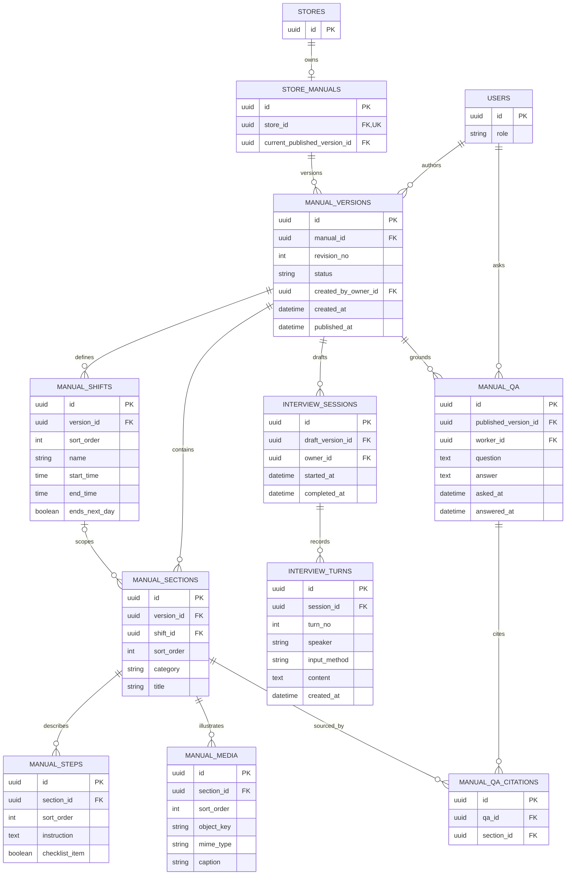

# 업무 매뉴얼·AI 인터뷰·질의응답 ERD

## 테이블과 제약

| 테이블 | 핵심 제약 |
| --- | --- |
| `store_manuals` | `store_id` UNIQUE. `current_published_version_id`는 같은 매뉴얼의 게시 버전만 참조 |
| `manual_versions` | `(manual_id, revision_no)` UNIQUE. `status`는 `DRAFT`/`PUBLISHED`. 초안은 `published_at IS NULL`, 게시본은 게시 시각 필수이며 게시 후 내용 불변 |
| `manual_shifts` | 버전별 오전·오후·야간 등 근무조와 시간. `(version_id, sort_order)` UNIQUE |
| `manual_sections` | `category`는 `COMMON_TASK`/`SHIFT_TASK`/`RULE`/`EQUIPMENT`. `shift_id`가 있으면 같은 버전에 속해야 함. `(version_id, sort_order)` UNIQUE |
| `manual_steps`, `manual_media` | 각 섹션 안에서 순서 UNIQUE. 사진은 파일 본문 대신 저장소 `object_key`와 선택 설명을 보관. 삭제 시 파일 정리 정책 필요 |
| `interview_sessions`, `interview_turns` | AI 인터뷰는 초안 버전에만 연결. 답변 방식은 `VOICE`/`TEXT`, 실제 저장 내용은 텍스트. `(session_id, turn_no)` UNIQUE |
| `manual_qa`, `manual_qa_citations` | 질문에는 당시 게시 버전을 고정하고 출처 섹션은 같은 버전이어야 함. 답변 근거가 없는 경우 사용자에게 근거 부족을 알리는 정책 필요 |

- 점주 설명 → AI 구조화 → 점주 수정·확인 → 게시 순서다. AI가 만든 초안은 `DRAFT`이고 근무자에게 공개하지 않는다. 게시 시 새 버전을 고정하고 `current_published_version_id`를 원자적으로 바꾼다. 이전 게시 버전과 그 출처는 당시 질의응답의 근거로 유지한다.
- 매뉴얼 조회와 AI 질의응답은 [매장 접근 권한](access.md)을 확인한 근무자에게 현재 게시 버전만 제공한다. 질의응답 저장 행은 당시 버전을 가리켜 이후 수정에도 출처가 달라지지 않는다.
- 사진은 공통 업무·규정 등 연결된 섹션에 붙인다. IR 자료에는 영상 보완 언급도 있지만 현재 상세 화면은 사진 첨부를 구체화했으므로 영상 처리·보존 정책은 후속 결정이다. 음성 원본의 장기 보관도 화면에서 확정되지 않아 이 ERD에는 전사 텍스트만 둔다.
- 화면 근거: [매뉴얼 작성 시작](https://www.figma.com/design/ZaFHresnBXJ1h98Xl1AUDj?node-id=560-4170), [AI 인터뷰](https://www.figma.com/design/ZaFHresnBXJ1h98Xl1AUDj?node-id=330-2713), [최종 검토·게시](https://www.figma.com/design/ZaFHresnBXJ1h98Xl1AUDj?node-id=330-2757), [사진 첨부](https://www.figma.com/design/ZaFHresnBXJ1h98Xl1AUDj?node-id=777-2979), [업무 목록](https://www.figma.com/design/ZaFHresnBXJ1h98Xl1AUDj?node-id=330-2819), [단계별 상세](https://www.figma.com/design/ZaFHresnBXJ1h98Xl1AUDj?node-id=624-2603), [AI 질의응답](https://www.figma.com/design/ZaFHresnBXJ1h98Xl1AUDj?node-id=330-2914), [IR Deck의 AI Rule Book](https://www.figma.com/design/ZaFHresnBXJ1h98Xl1AUDj?node-id=597-2700).
