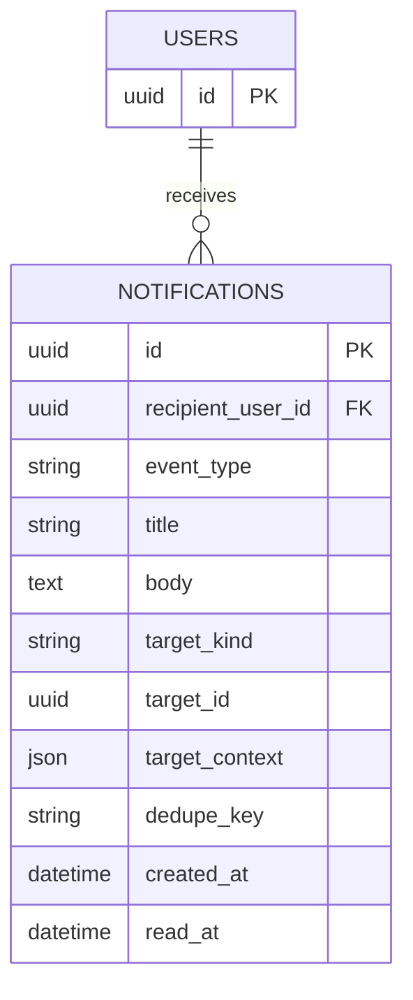

# 앱 알림 ERD

## 제약과 조회

- `recipient_user_id`는 `users.id` FK다. `read_at IS NULL`이면 안 읽음이며, 안 읽은 수는 별도 카운터를 저장하지 않고 조회한다. 카드를 선택하면 해당 알림 한 건을 읽음 처리하고 재요청은 최초 read_at을 유지한다. 화면의 `모두 읽음`은 미확인 목록이 빈 상태이며 일괄 읽기 API는 범위에 없다.
- `event_type`은 지원 접수·근무 요청 미응답·근무 확정·초대 수락/만료·매장 승인·매뉴얼 게시·다음 날 근무 등을 구분한다. `title`/`body`는 생성 당시 표시 문구를 보관하는 스냅샷이다.
- `target_kind`/`target_id`는 알림 클릭 시 화면 이동용 참조다. `target_context`는 API typed target에 필요한 보조 ID/날짜 snapshot이다. JOB_APPLICATION은 applicationId(target_id)·storeId·jobId, WORK_REQUEST는 requestId(target_id)·storeId·jobId, STORE_INVITATION은 invitationId, STORE/MANUAL은 storeId, WORK_SCHEDULE은 eventId(target_id)·storeId·서울 workDate를 담는다. 타입별 필수 값을 생성 시 검증하고 외부 URL·토큰은 저장하지 않는다. 여러 도메인을 가리키므로 공통 FK로 사용하지 않는다. 대상의 존재와 열람 권한은 이동 후 서버에서 다시 검사한다. `dedupe_key`는 동일 이벤트의 중복 발행을 막기 위한 선택적 키이며 `(recipient_user_id, dedupe_key)`를 UNIQUE로 둔다.
- `work_requests`는 min(요청+1시간, 근무 시작)부터 EXPIRED로 판정한다. 미응답 알림이나 배치 지연으로 PENDING 수락 기한을 연장하지 않는다. 알림 발행 예약(outbox)은 근무 확정·매장 승인 같은 도메인 상태 전이와 원자 저장하고, 실제 전달 실패로 원본 거래를 되돌리지 않는다. outbox/재시도 저장 구조는 공통 실행 기반에서 결정한다.
- 요청 철회/확정 철회 이벤트는 WORK_REQUEST_WITHDRAWN/WORK_CONFIRMATION_WITHDRAWN이며 종료된 WORK_REQUEST로 이동한다. 일정 알림은 workDate의 월을 열고 eventId를 강조한다. 철회된 일정이 활성 목록에서 없어도 저장된 target_context로 월과 매장을 알 수 있으며 자료 접근을 복원하지 않는다.
- 화면 근거: [일반회원 알림](https://www.figma.com/design/ZaFHresnBXJ1h98Xl1AUDj?node-id=506-3834), [점주 알림](https://www.figma.com/design/ZaFHresnBXJ1h98Xl1AUDj?node-id=506-3842), [모두 읽음 상태](https://www.figma.com/design/ZaFHresnBXJ1h98Xl1AUDj?node-id=506-4518), [근무 요청 미응답 알림](https://www.figma.com/design/ZaFHresnBXJ1h98Xl1AUDj?node-id=698-2981).
