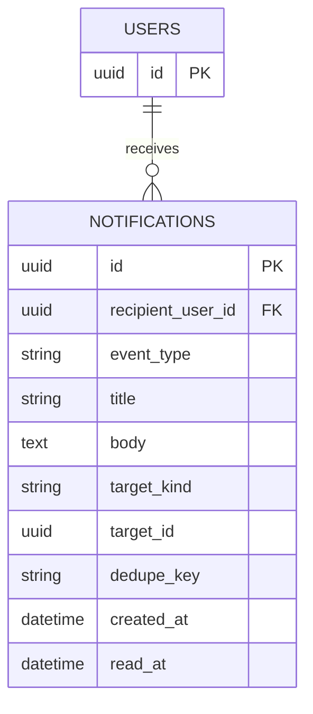

# 앱 알림 ERD

## 제약과 조회

- `recipient_user_id`는 `users.id` FK다. `read_at IS NULL`이면 안 읽음이며, 안 읽은 수는 별도 카운터를 저장하지 않고 조회한다. `모두 읽음`은 해당 사용자의 미확인 행을 일괄 갱신한다.
- `event_type`은 지원 접수·근무 요청 미응답·근무 확정·초대 수락/만료·매장 승인·매뉴얼 게시·다음 날 근무 등을 구분한다. `title`/`body`는 생성 당시 표시 문구를 보관하는 스냅샷이다.
- `target_kind`/`target_id`는 알림 클릭 시 화면 이동용 참조다. 여러 도메인을 가리키므로 공통 FK로 사용하지 않는다. 대상의 존재와 열람 권한은 이동 후 서버에서 다시 검사한다. `dedupe_key`는 동일 이벤트의 중복 발행을 막기 위한 선택적 키이며 `(recipient_user_id, dedupe_key)`를 UNIQUE로 둔다.
- `work_requests`의 1시간 미응답 알림을 만들더라도 요청 상태는 `PENDING`으로 유지한다. 알림 생성은 근무 확정·매장 승인 같은 도메인 트랜잭션의 결과를 반영하며, 전달 실패로 원본 거래를 되돌리지 않는다.
- 화면 근거: [일반회원 알림](https://www.figma.com/design/ZaFHresnBXJ1h98Xl1AUDj?node-id=506-3834), [점주 알림](https://www.figma.com/design/ZaFHresnBXJ1h98Xl1AUDj?node-id=506-3842), [모두 읽음 상태](https://www.figma.com/design/ZaFHresnBXJ1h98Xl1AUDj?node-id=506-4518), [근무 요청 미응답 알림](https://www.figma.com/design/ZaFHresnBXJ1h98Xl1AUDj?node-id=698-2981).
