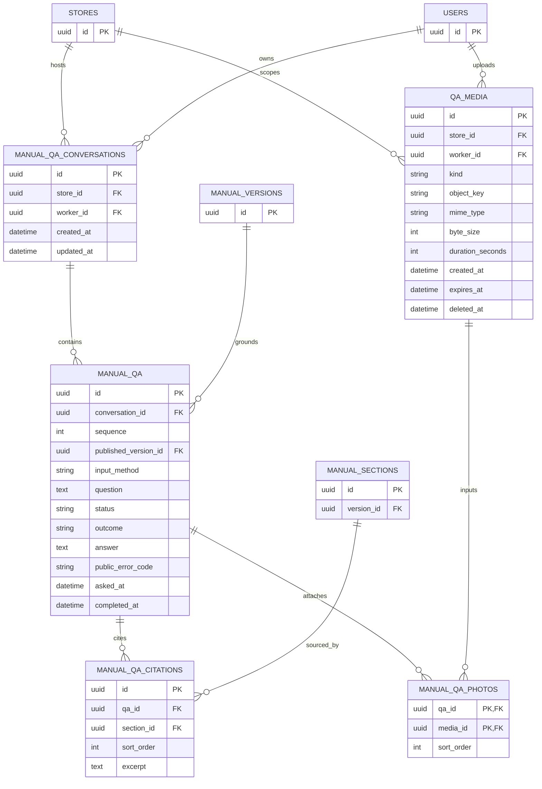

# 근무자 AI 업무 질문 ERD

게시 매뉴얼에 근거한 본인의 대화 복원·질문·사진/음성 입력을 표현한다. 점주 [인터뷰와 게시본](manual.md)의 내부 자료는 근무자 질문의 근거로 사용하지 않는다.

## 테이블과 제약

| 테이블 | 핵심 제약 |
| --- | --- |
| `manual_qa_conversations` | 매장과 질문한 WORKER에 귀속. 접근 종료 후에도 이력을 다른 사용자에게 넘기지 않으며 현재 권한 없이는 복원 불가 |
| `manual_qa` | `(conversation_id, sequence)` UNIQUE. 질문마다 접수 당시 현재 게시 버전을 고정. question은 텍스트 또는 완료 전사를 텍스트로 보존. 상태 `RUNNING/READY/ERROR`. RUNNING은 answer/오류/completed_at NULL, READY는 answer·outcome·completed_at 필수, ERROR는 공개 오류·completed_at 필수 및 answer NULL |
| `manual_qa_citations` | `(qa_id, sort_order)` UNIQUE. 같은 질문의 게시 버전에 속하는 섹션만 참조. ANSWERED이면 1~10개 근거, NEEDS_OWNER이면 0개. excerpt는 당시 근거 발췌를 보존하고 sectionTitle/versionId는 불변 게시본에서 조회 가능 |
| `qa_media` | 같은 매장·본인 WORKER의 비공개 IMAGE/AUDIO. 점주 업로드와 소유권을 분리. 원문 object_key는 응답 금지. expires_at/deleted_at으로 보관 기한과 정리 상태 표현 |
| `manual_qa_photos` | 같은 매장·본인 질문의 IMAGE만 최대 3개. `(qa_id, sort_order)` UNIQUE이며 질문 내 중복 파일 금지. 대화의 worker/store와 파일 귀속 일치 검증 |

- `outcome=ANSWERED`는 게시본에 충분한 근거가 있을 때만 허용한다. 근거 부족 또는 미확정 정보는 `NEEDS_OWNER`로 표시한다. 사진과 사용자 지시가 점주 매뉴얼의 사실을 바꾸지 않는다.
- 질문 생성은 sequence 할당·게시본 고정·질문/사진 저장·작업 예약을 원자 처리한다. 실패 재시도는 동일 질문과 게시 버전을 보존하고 현재 접근·입력 보존 기한을 확인한다. 새 질문과 재시도를 구분한다. 비동기 작업 ID·시도·전사 결과·멱등성 저장소는 공통 실행 기반에서 결정하며 endpoint별 작업 테이블을 강제하지 않는다.
- 대화/질문/사진/전사는 현재 USE_AI_QA가 있는 본인만 조회한다. 수동 접근 종료 또는 만료 후 늦게 완료된 결과도 반환하지 않는다. 현재 게시본이 바뀌면 과거 질문은 고정된 버전을 유지하고 근거 링크의 expectedVersionId 불일치는 MANUAL_VERSION_CHANGED로 안내한다. 과거 버전 전체를 읽을 권한을 부여하지 않는다.
- 사진 10 MiB/7일, 음성 20 MiB·120초/24시간은 OpenAPI 보완 설계를 따른다. 전사 완료 텍스트는 질문에 보존하고 원본 미디어 정리 후에도 질문·답변·인용 이력을 유지한다. 파일 정리와 참조 메타데이터 보존을 구분하며 만료/삭제된 입력으로 재처리할 수 없다.
- 실제 AI의 근거 충실도, 파일 검증과 만료·삭제 경쟁, 큐 복구와 DB 트랜잭션은 구현 시 통합 검증한다.
