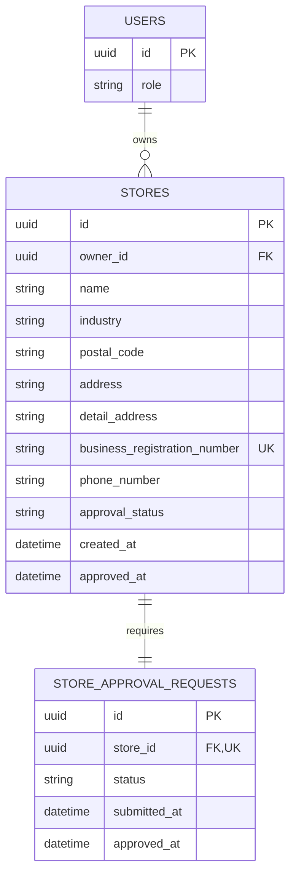

# 매장과 운영 승인 ERD

## 테이블과 제약

| 테이블 | 핵심 제약 |
| --- | --- |
| `stores` | `owner_id`는 `role=OWNER`인 `users.id` FK. 한 매장에는 점주 1명, 한 점주는 여러 매장 소유 가능. 사업자 번호는 하이픈 제거 후 UNIQUE. `approval_status`는 `PENDING`/`APPROVED`. `PENDING`이면 `approved_at IS NULL`, `APPROVED`이면 승인 시각 필수 |
| `store_approval_requests` | `store_id` UNIQUE: 현 계약에서는 매장당 최초 신청 1건. 신청자는 `stores.owner_id`를 통해 조회하며 현 범위에서 소유자 변경 없음. 요청 상태와 승인 시각은 `stores`와 일치 |

- 점주 가입과 최초 매장·승인 신청은 한 트랜잭션으로 생성한다. 승인 전에도 `owner_id`는 저장하지만 매장 운영 권한은 허용하지 않는다. 승인 처리에서는 신청과 매장 상태를 함께 갱신하고 이후 운영 권한은 승인 상태로 판정한다. 이미 승인된 신청에 대한 재요청은 최초 `approved_at`을 유지한다.
- 매장 주소가 월계1동인지 서버의 주소 데이터로 확인한다. 문자열에 `월계1동`이 포함되었다는 이유만으로 승인하지 않는다. 동일 사업자 번호의 매장을 중복 생성하거나 새 점주에게 자동 관리 권한을 주지 않는다.
- [점주 홈의 매장 추가](https://www.figma.com/design/ZaFHresnBXJ1h98Xl1AUDj?node-id=192-5168)는 한 점주가 여러 매장을 갖는 1:N 관계로 표현한다. 공동 관리·소유권 이전 절차는 화면/API에 없어 이번 ERD에 포함하지 않는다.
- 화면 근거: [매장 등록](https://www.figma.com/design/ZaFHresnBXJ1h98Xl1AUDj?node-id=220-401), [가입 확인](https://www.figma.com/design/ZaFHresnBXJ1h98Xl1AUDj?node-id=335-1007), [승인 대기](https://www.figma.com/design/ZaFHresnBXJ1h98Xl1AUDj?node-id=335-1008). 관리자 조회·승인 계약은 [이슈 #92](https://github.com/2026-KW-HACKATHON/29_Jidan/issues/92) 기준이다. 공용 관리자 비밀번호는 개인 관리자 FK를 만들 근거가 아니며 DB에 원문을 저장하지 않는다.
