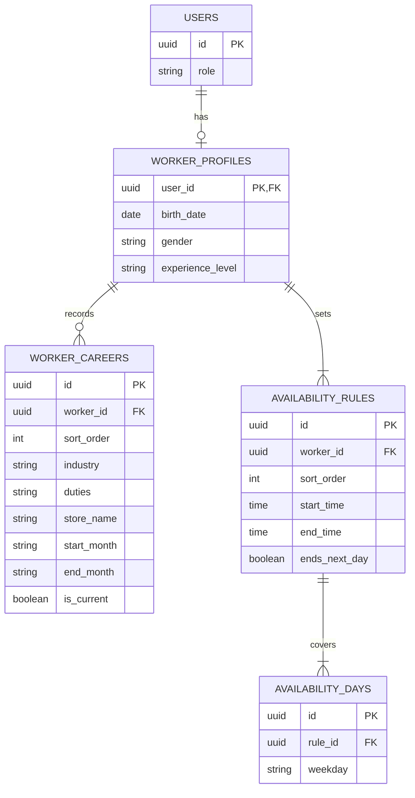

# 일반회원 프로필 ERD

## 테이블과 제약

| 테이블 | 핵심 제약 |
| --- | --- |
| `worker_profiles` | `user_id`는 `users.id`를 참조하며 `users.role=WORKER`인 경우에만 생성. `gender`는 `MALE`/`FEMALE`, `experience_level`은 `NEW`/`EXPERIENCED` |
| `worker_careers` | `worker_id` FK. `NEW`면 0건, `EXPERIENCED`면 1~20건. `is_current=true`이면 `end_month IS NULL`, 아니면 종료 월 필수. `start_month <= end_month`와 미래 월 금지. `(worker_id, sort_order)` UNIQUE |
| `availability_rules` | `worker_id` FK. 사용자당 1~100개 그룹. 시작·종료는 30분 단위, 기간은 `0 < 기간 <= 24시간`. `(worker_id, sort_order)` UNIQUE |
| `availability_days` | `rule_id` FK. 요일은 `MON`~`SUN`, 그룹당 1~7일. `(rule_id, weekday)` UNIQUE |

- 한 화면에서 같은 시간대를 여러 요일에 적용하므로 시간 그룹과 요일을 분리한다. 서버는 저장할 때 모든 그룹을 요일별 주간 구간으로 펼쳐 중복을 검사한다. `SUN` 심야에서 `MON` 새벽으로 넘어가는 구간도 포함하며, 끝과 시작이 맞닿기만 한 구간은 허용한다.
- `worker_careers.store_name`은 과거 근무지의 자유 입력이다. 지단에 등록된 `stores`와 동일한 매장이라고 확인할 수 없으므로 FK를 두지 않는다.
- 프로필의 이름·전화번호·Google 이메일은 `users`에 둔다. Google 이메일은 읽기 전용이다. 가입 마지막 단계의 입력은 최종 확인 시 한 번에 저장한다. 근무 정보와 가능 시간 수정은 각각 해당 자식 행 전체를 원자적으로 교체하는 설계다.
- 화면 근거: [기본 정보](https://www.figma.com/design/ZaFHresnBXJ1h98Xl1AUDj?node-id=255-687), [경력 추가](https://www.figma.com/design/ZaFHresnBXJ1h98Xl1AUDj?node-id=255-690), [현재 근무](https://www.figma.com/design/ZaFHresnBXJ1h98Xl1AUDj?node-id=506-4178), [가능 시간](https://www.figma.com/design/ZaFHresnBXJ1h98Xl1AUDj?node-id=255-692), [내 프로필](https://www.figma.com/design/ZaFHresnBXJ1h98Xl1AUDj?node-id=255-695). 배열 상한·중첩 검사는 [인증 계약 이슈 #90](https://github.com/2026-KW-HACKATHON/29_Jidan/issues/90)의 OpenAPI 초안에 맞춘 DB 제안이다.
