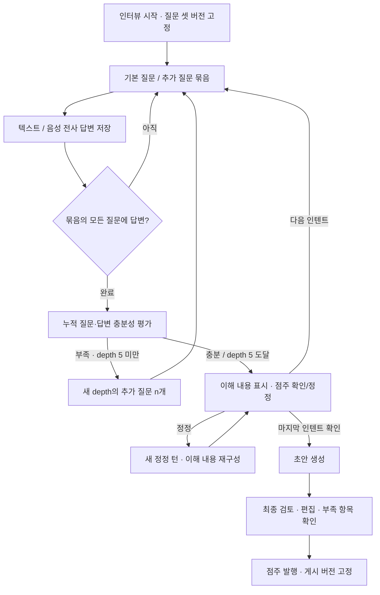

# 매뉴얼·점주 AI 인터뷰 API 계약

이 문서는 Figma 화면과 ERD 검수 초안을 바탕으로 작성한 **구현 전 OpenAPI 계약**이다. 실제 AI·STT·스토리지·DB·인가 처리의 구현 완료를 의미하지 않는다. 명세는 `../openapi.yaml`, 읽기 전용 Swagger는 http://127.0.0.1:5500 이다.

## 핵심 흐름과 사용자 결정

점주 답변 → AI의 정보 충분성 판단 → 필요한 추가 질문 → 주제별 이해 확인 → 매뉴얼 초안 → 점주 검토·수정 → 발행 순서다. AI가 다른 매장의 절차를 이 매장의 사실로 채우거나 초안을 자동 발행하지 않는다.

2026-10-05 사용자가 **“부족 항목을 표시하고, 점주 확인만으로 발행 가능”**으로 결정했다. 기본 질문 이후 depth 1~5의 가변 추가 질문 묶음을 받고, depth 5에서도 부족하면 `NEEDS_DETAIL`을 보존한다. 점주가 이해 내용을 확인하면 다음 인텐트로 진행한다. 최종 초안에서 부족 항목을 명시적으로 확인하면 보완 답변이나 메모 없이 발행할 수 있다. 점주 확인은 AI 충분성 판단을 `COVERED`로 바꾸지 않는다.

최종 검토 중에는 `acknowledgements`로 항목 확인을 저장할 수 있다. 최종 게시 버튼에서 `publication`에 현재 OPEN 항목 ID를 전부 보내면 같은 트랜잭션 안에서 확인과 발행을 수행한다. 다른 revision의 확인, 일부 항목 누락, 숨겨진 기본 동의는 허용하지 않는다.

## API 목록

아래 표에서 `M`은 `/api/stores/{storeId}/manual`, `S`는 `M/interviews/{sessionId}`이다. 총 22개 operation을 추가했다.

| 그룹 | 메서드·경로 | 용도 |
| --- | --- | --- |
| 매뉴얼 상태 | `GET M` | 작성 시작/이어하기/게시 상태 |
| 초안 | `GET M/draft` | 생성 상태·내용·부족 항목 |
| 파일 | `POST M/media` | 비공개 사진·음성 업로드 |
| 파일 | `DELETE M/media/{mediaId}` | 미참조 파일 삭제 |
| 사진 | `GET M/media/{mediaId}/content` | 현재 권한으로 사진 byte 조회 |
| 음성 | `POST M/transcriptions` | 전사 요청·실패 재시도 |
| 음성 | `GET M/transcriptions/{transcriptionId}` | 전사 상태·텍스트 |
| 인터뷰 | `POST M/interviews` | 새 초안과 버전 고정 세션 시작 |
| 인터뷰 | `GET S` | 현재 질문·이해 확인·처리/오류 상태 |
| 인터뷰 | `GET S/turns` | 순서대로 대화 이력 조회 |
| 답변 | `POST S/answers` | 현재 질문에 텍스트/완료 전사 답변 |
| 정정 | `POST S/corrections` | 현재 이해 확인 내용 정정 |
| 확인 | `POST S/confirmations` | 현재 이해 확인 후 다음 주제로 이동 |
| 사진 | `PUT S/photos` | 이해 확인 화면의 사진·설명·순서 |
| 생성 | `POST S/completion` | 인터뷰 완료·초안 생성 예약 |
| 복구 | `POST S/retries` | 저장한 입력으로 실패 작업 재개 |
| 편집 | `PUT M/draft/content` | 근무 구조·업무·규정·설비·사진 전체 편집 |
| 미리보기 | `GET M/draft/preview` | 점주가 보는 게시 전 근무자 화면 |
| 확인 | `POST M/draft/acknowledgements` | 부족 항목에 대한 점주 확인 저장 |
| 발행 | `POST M/draft/publication` | 최종 확인·게시본 전환 |
| 열람 | `GET M/published` | 전체/공통/선택 근무조 업무 목록 |
| 열람 | `GET M/published/sections/{sectionId}` | 현재 게시 업무의 단계·사진 상세 |

AI 질의응답·인용 응답, 일별 체크리스트 실행, 인터뷰 폐기/게시 취소/과거 버전 관리 API는 별도 범위다. 체크리스트 대상 여부(`checklistItem`)는 매뉴얼 지시문의 힌트만 정의한다.

## 권한과 공개 범위

- 점주 기능은 ACTIVE OWNER, 해당 매장의 현재 소유권과 APPROVED를 확인한다. 변경에는 세션 쿠키와 CSRF 토큰·정확한 허용 Origin이 필요하다. 관리자 body password는 사용하지 않는다.
- 근무자 열람은 ACTIVE WORKER와 현재 유효한 `READ_MANUALS` 자료 접근을 확인한다. 정기/대타 중 하나라도 유효하면 가능하며 만료 시각과 같은 순간부터 차단한다. 시작 전·수동 종료 접근은 유효하지 않다.
- 자료 열람은 OWNER도 소유 매장에서 가능하다. 점주 초안/미리보기/대화/전사/평가는 WORKER에게 제공하지 않는다.
- 매장 권한 확인 뒤 게시 여부와 하위 ID를 검사한다. 존재하지 않는 매장과 접근할 수 없는 매장은 같은 404다. 다른 매장 파일·세션·섹션을 UUID만으로 가져올 수 없다.
- 사진은 서버 proxy로 조회하고 공개 object URL/signed URL/object key를 반환하지 않는다. WORKER는 현재 게시 버전이 참조하는 사진만 볼 수 있다. 점주는 연결된 인터뷰/초안 사진도 볼 수 있다.
- 모든 응답은 `Cache-Control: no-store`다. 대화·음성·평가 원문은 로그/분석에 기록하지 않는다. AI/전사 provider의 원문 오류·prompt·stack을 API에 노출하지 않는다.

## 상태·동시성·복구

세션은 `IN_PROGRESS / ERROR / COMPLETED`, 화면 phase는 아래와 같이 구분한다. 조회 operation에는 각 phase의 응답 예시를 제공한다. 예시는 각 경계의 독립 스냅샷이며 모든 endpoint 예시가 하나의 연속 대화인 것은 아니다.

| phase | 프론트 처리 |
| --- | --- |
| `COLLECTING` | 공개 questions와 answered 표시. 묶음 안 답변 순서는 자유 |
| `PROCESSING` | 질문 생성/평가/이해 재구성 작업 대기 |
| `REVIEWING` | 이해 내용·선택 사진 확인 또는 정정 |
| `READY_TO_GENERATE` | 모든 필수 인텐트 진행·확인 완료, 초안 생성 요청 가능 |
| `GENERATING` | 초안 생성 대기. 편집/발행 차단 |
| `ERROR` | 공개 오류와 재시도 안내. 저장된 답변 재입력 불필요 |
| `COMPLETED` | 초안 READY 확인 후 최종 검토로 이동 |

변경 요청은 해당 세션 또는 초안의 `expectedRevision`과 UUID `Idempotency-Key`를 사용한다. 새 요청은 현재 revision·상태를 확인하고, 상태를 바꾸는 진행/작업 결과는 revision을 증가시킨다. 실질 변경이 없는 편집과 동일 확인은 증가하지 않는다. 같은 key는 현재 권한을 재검사한 뒤 최초 결과를 재현하며, 다른 body/파일 byte hash는 409다. 캐시 응답은 과거 상태일 수 있으므로 최신 GET으로 화면을 복구한다. 24시간 보관은 설계 제안이다. 단순 파일 삭제는 tombstone으로 최초 주체/매장을 확인하는 204 멱등 동작이다.

답변 저장과 작업 예약, 성공 평가 적용과 다음 진행, 생성 결과와 초안/세션 완료, 발행과 게시 포인터/알림 outbox는 각각 원자적이다. 외부 AI 실행 동안 DB 트랜잭션을 계속 열지 않는다. worker 작업 결과는 task ID·입력 revision을 확인하며 지연/중복 작업이 최신 상태를 덮어쓰지 않도록 한 번만 적용한다.

질문 셋/필수 인텐트 순서는 세션 시작 시 고정한다. 충분성 판단(Jev)과 질문 문구 생성은 분리한다. 묶음의 모든 질문에 답변한 뒤 누적 내용으로 판단한다. 기본 질문은 depth 0, 추가 묶음은 depth 1~5이며 재시도는 depth를 증가시키지 않는다. 부분 생성 질문은 공개하지 않는다.

자동 재시도 → fallback → 공개 ERROR 뒤 수동 재개를 지원한다. 원래 답변·질문·묶음·인텐트 위치를 보존하고 시도 번호만 증가한다. 평가 입력 snapshot·실제 설정 버전·시도 이력은 내부에 불변 저장하며 같은 depth의 성공 진행은 한 번만 적용한다. 질문 생성 실패를 정보 충분성 판단으로 취급하지 않는다.

이해 확인 중 정정은 새 CORRECTION 턴으로 기록한다. 과거 평가 입력을 덮어쓰지 않고 현재 이해 내용만 재구성한다. depth와 마지막 충분성 판단 이력은 유지하며 점주가 새 내용을 다시 확인한다. 이전 주제의 변경은 최종 초안 편집에서 수행한다.

## 사진·음성

업로드는 실제 MIME·byte·디코딩을 검사한 뒤 mediaId를 반환한다. 사진은 JPEG/PNG/WebP 최대 10 MiB, 음성은 MPEG/MP4/WebM/WAV 최대 20 MiB 및 120초다. 상한과 포맷/보관 기간은 화면에 없는 설계 제안이다. 빈 파일·잘못된 형식·상한 초과를 구분한다. 이미지 EXIF 위치 정보는 제거한다.

음성 업로드 → 전사 요청 → GET 전사 READY → 인터뷰 답변의 VOICE/transcriptionId 제출 순서다. 전사가 답변을 자동 제출하지 않는다. 텍스트를 고쳐 제출하려면 TEXT 방식으로 제출한다. 진행 중/실패 전사는 답변에 쓸 수 없다. 무음과 공백 결과는 ERROR다. 전사 ERROR는 새 key로 같은 전사 ID를 재시도하고, 이미 파일이 정리되었으면 다시 업로드한다.

사진은 답변의 photoIds, 이해 확인 화면의 주제별 사진 또는 최종 초안 photos로 연결한다. 근무 구조 전체 사진은 `structurePhotos`, 업무별 사진은 섹션의 `photos`다. 캡션은 선택이고 배열 순서가 표시 순서다. 연결된 파일은 삭제를 거절하며 먼저 초안 연결을 해제해야 한다. 게시본이 참조하는 사진은 계속 보존한다.

미첨부 파일은 24시간 뒤, 음성 원본은 전사 종료 후 24시간 이내 정리한다. 세션/초안/게시본에 연결된 사진은 참조가 유지되는 동안 정리하지 않는다. 삭제·연결 경쟁, orphan 정리, 업로드 처리 한도, 실제 장기 보존/계정 삭제 정책은 구현 시 검증·확정해야 한다.

## 초안·게시본

`ManualContent`는 근무조, 공통·조별 업무/규정/설비 섹션, 지시 단계, 사진을 포함한다. ID 중복, 동일 버전의 근무조 참조, 시간 길이, 같은 매장 파일, 사진 중복은 서버 검증이다. 야간은 endsNextDay로 표시하고 0 < duration <= 24시간을 허용한다. 근무조 간 시간 겹침은 허용한다.

초안 전체 편집은 expectedRevision으로 최신 내용만 교체한다. 실제 content 변경 시 부족 항목 확인을 초기화하고 기존 확인은 감사 이력에 남긴다. AI 생성 중에는 편집을 받지 않는다. 생성 후 AI 작업이 점주가 편집한 내용을 다시 덮어쓰지 않는다.

발행은 초안 상태 전환·점주 확인·게시 포인터 변경·활성 초안 해제·알림 outbox를 같은 트랜잭션으로 저장한다. 이후 게시 content는 불변이고 수정하려면 새 인터뷰/다음 버전 초안을 만든다. 기존 게시본은 새 버전 발행 전까지 유지하며 기존 답변·평가·동의·인용 근거는 보존한다. 알림 실제 전달 실패는 발행 완료를 되돌리지 않는다.

근무자는 현재 게시본만 읽는다. 업무 목록은 선택 근무조 업무와 모든 조의 공통 업무·규정·설비를 함께 볼 수 있다. 목록의 versionId를 상세/사진 요청의 expectedVersionId로 보내면 게시본 교체를 409 MANUAL_VERSION_CHANGED로 감지한다. 해당 query는 과거 버전 조회 selector가 아니다. 한 요청은 같은 게시 버전 스냅샷으로 응답한다.

## 검증 범위

OpenAPI lint, 모든 요청/응답 예시의 JSON Schema 검사, 상태별 필수 값·깊이/배치·텍스트/ID/배열 경계·필드 주입·사진 MIME/크기·동의 입력을 검증한다. 정적 예시의 인텐트/근무조 참조, UUID 중복, 시간 길이, 공개 phase와 추가 질문 ID 일관성도 확인한다. 기존 28개 operation과 기존 components는 구조 비교로 보존한다.

이 검증은 명세·정적 예시·문서 서버 HTTP에 한정한다. DB 직렬화/rollback, 실제 충분성 판단 품질·가변 질문 품질·fallback, 전사 정확도, 업로드 signature/디코더 보호·EXIF 제거, 저장소 정리, 실제 계정/권한 변경 및 게시 경쟁, 알림 전달은 통합 테스트하지 않았다.

## 화면과 기존 설계 근거

- [매뉴얼 시작](https://www.figma.com/design/ZaFHresnBXJ1h98Xl1AUDj?node-id=560-4170), [근무 구조 인터뷰](https://www.figma.com/design/ZaFHresnBXJ1h98Xl1AUDj?node-id=330-2713)
- [이해 확인](https://www.figma.com/design/ZaFHresnBXJ1h98Xl1AUDj?node-id=346-1421), [답변 정정](https://www.figma.com/design/ZaFHresnBXJ1h98Xl1AUDj?node-id=346-1422)
- [음성 입력](https://www.figma.com/design/ZaFHresnBXJ1h98Xl1AUDj?node-id=376-1676), [처리 중](https://www.figma.com/design/ZaFHresnBXJ1h98Xl1AUDj?node-id=376-1711)
- [최종 검토·게시](https://www.figma.com/design/ZaFHresnBXJ1h98Xl1AUDj?node-id=330-2757), [사진 관리](https://www.figma.com/design/ZaFHresnBXJ1h98Xl1AUDj?node-id=777-2979)
- [근무자 미리보기](https://www.figma.com/design/ZaFHresnBXJ1h98Xl1AUDj?node-id=777-3203), [업무 목록](https://www.figma.com/design/ZaFHresnBXJ1h98Xl1AUDj?node-id=624-2990), [업무 상세](https://www.figma.com/design/ZaFHresnBXJ1h98Xl1AUDj?node-id=624-2603)
- ERD 검수 초안 `manual.md`, `ai-interview-flow.md`의 질문 셋 버전·Jev/생성 분리·불변 평가 이력·게시 버전 정책 참조. 이 API 작업은 ERD 파일을 수정하지 않았다. 해당 초안의 미확정 발행 정책은 이번 사용자의 확인 결정으로 이 계약에서 구체화했다.
