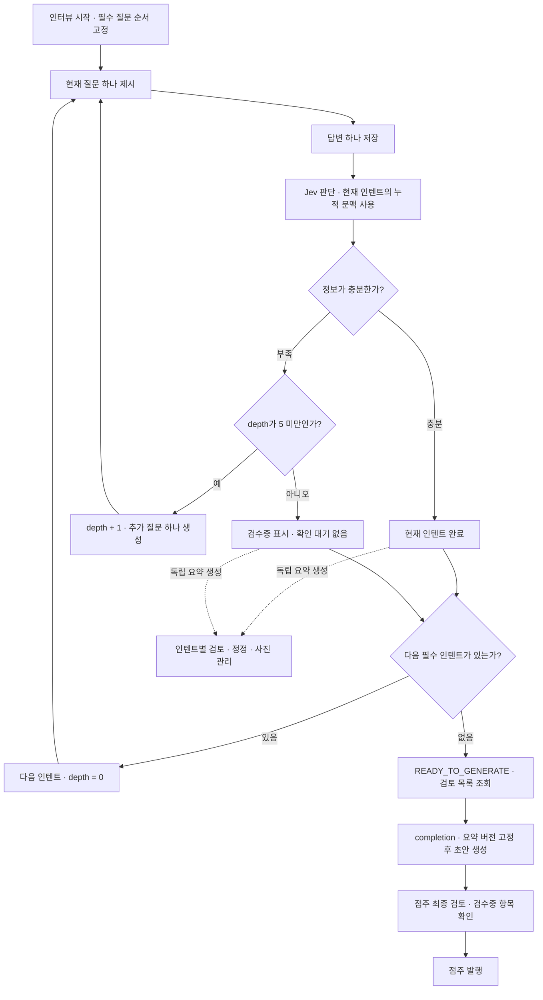

# 매뉴얼·점주 AI 인터뷰 API 계약

이 문서는 Figma 화면과 ERD 검수 초안을 바탕으로 작성한 **구현 전 OpenAPI 계약**이다. 실제 AI·STT·스토리지·DB·인가 처리의 구현 완료를 의미하지 않는다. 명세는 `../openapi.yaml`, 읽기 전용 Swagger는 http://127.0.0.1:5500 이다.

## 핵심 흐름과 사용자 결정

질문 하나 → 답변 하나 → Jev 판단 순서다. 충분하면 즉시 다음 필수 질문으로, 부족하면 같은 인텐트의 추가 질문 한 개로 이어진다. 모든 인텐트 진행 후 매뉴얼 초안 → 점주 최종 검토·수정 → 발행 순서다. AI가 다른 매장의 절차를 이 매장의 사실로 채우거나 초안을 자동 발행하지 않는다.

2026-10-05 사용자가 **“부족 항목을 표시하고, 점주 확인만으로 발행 가능”**으로 결정했다. 기본 질문 이후 depth 1~5의 추가 질문을 한 개씩 받고 각 답변마다 판단한다. depth 5에서도 부족하면 `NEEDS_DETAIL`을 보존한다. 해당 항목을 **검수중**으로 표시하고 finishedAt을 기록한 뒤 **확인을 기다리지 않고 바로 다음 인텐트로 진행한다**. 중간 점주 확인은 진행 조건이 아니며 확인 상태는 별도 검토 리소스에서 관리한다. 마지막 인텐트면 READY_TO_GENERATE로 진행한다. 최종 초안에서 부족 항목을 명시적으로 확인하면 보완 답변이나 메모 없이 발행할 수 있다. 점주 확인은 AI 충분성 판단을 `COVERED`로 바꾸지 않는다.

최종 검토 중에는 `acknowledgements`로 항목 확인을 저장할 수 있다. 최종 게시 버튼에서 `publication`에 현재 OPEN 항목 ID를 전부 보내면 같은 트랜잭션 안에서 확인과 발행을 수행한다. 다른 revision의 확인, 일부 항목 누락, 숨겨진 기본 동의는 허용하지 않는다.

## API 목록

아래 표에서 `M`은 `/api/stores/{storeId}/manual`, `S`는 `M/interviews/{sessionId}`, `R`은 `S/intents/{intentId}/review`이다. 매뉴얼·인터뷰 영역은 총 28개 operation이다.

| 그룹 | 메서드·경로 | 용도 |
| --- | --- | --- |
| 매뉴얼 상태 | `GET M` | 작성 시작/이어하기/게시 상태 |
| 초안 | `GET M/draft` | 생성 상태·내용·부족 항목 |
| 파일 | `POST M/media` | 비공개 사진·음성 업로드 |
| 파일 | `DELETE M/media/{mediaId}` | 미참조 파일 삭제 |
| 사진 | `GET M/media/{mediaId}/content` | 현재 권한으로 사진 byte 조회 |
| 음성 | `POST M/transcriptions` | 전사 요청·실패 재시도 |
| 음성 | `GET M/transcriptions/{transcriptionId}` | 전사 상태·텍스트 |
| 인터뷰 | `POST M/interviews` | 새 초안과 버전 고정 세션 시작 |
| 인터뷰 | `GET S` | 현재 질문·진행 상태·처리/오류 |
| 검토 | `GET S/reviews` | 완료 인텐트의 요약·검토 목록과 sessionRevision |
| 검토 | `GET R` | 선택 인텐트의 요약·사진·확인·처리 상태 |
| 검토 복구 | `POST R/retries` | 요약 생성·정정 실패 재시도 |
| 인터뷰 | `GET S/turns` | 순서대로 대화 이력 조회 |
| 답변 | `POST S/answers` | 현재 질문에 텍스트/완료 전사 답변 |
| 정정 | `POST R/corrections` | 완료 인텐트의 요약 정정 |
| 확인 | `POST R/confirmations` | 선택 요약 확인 · 질문 진행 조건 아님 |
| 사진 | `PUT R/photos` | 선택 요약의 사진·이름·설명·순서 |
| 생성 | `POST S/completion` | 인터뷰 완료·초안 생성 예약 |
| 복구 | `POST S/retries` | 저장한 입력으로 실패 작업 재개 |
| 편집 | `PUT M/draft/content` | 근무 구조·업무·규정·설비·사진 전체 편집 |
| 미리보기 | `GET M/draft/preview` | 점주가 보는 게시 전 근무자 화면 |
| 확인 | `POST M/draft/acknowledgements` | 부족 항목에 대한 점주 확인 저장 |
| 발행 | `POST M/draft/publication` | 최종 확인·게시본 전환 |
| 열람 | `GET M/published` | 전체/공통/선택 근무조 업무 목록 |
| 열람 | `GET M/published/sections/{sectionId}` | 현재 게시 업무의 단계·사진 상세 |

AI 질의응답·인용 응답은 [업무 질문 계약](qa-conversation-design.md)과 [질문 미디어 계약](qa-media-design.md)에 별도 챕터로 정의했다. 일별 체크리스트 실행, 인터뷰 폐기/게시 취소/과거 버전 관리 API는 이 화면 범위에 없다. 체크리스트 대상 여부(`checklistItem`)는 매뉴얼 지시문의 힌트만 정의한다.

## 권한과 공개 범위

- 점주 기능은 ACTIVE OWNER, 해당 매장의 현재 소유권과 APPROVED를 확인한다. 변경에는 세션 쿠키와 CSRF 토큰·정확한 허용 Origin이 필요하다. 관리자 body password는 사용하지 않는다.
- 근무자 열람은 ACTIVE WORKER와 현재 유효한 `READ_MANUALS` 자료 접근을 확인한다. 정기/대타 중 하나라도 유효하면 가능하며 만료 시각과 같은 순간부터 차단한다. 시작 전·수동 종료 접근은 유효하지 않다.
- 자료 열람은 OWNER도 소유 매장에서 가능하다. 점주 초안/미리보기/대화/전사/평가는 WORKER에게 제공하지 않는다.
- 매장 권한 확인 뒤 게시 여부와 하위 ID를 검사한다. 존재하지 않는 매장과 접근할 수 없는 매장은 같은 404다. 다른 매장 파일·세션·섹션을 UUID만으로 가져올 수 없다.
- 사진은 서버 proxy로 조회하고 공개 object URL/signed URL/object key를 반환하지 않는다. WORKER는 현재 게시 버전이 참조하는 사진만 볼 수 있다. 점주는 연결된 인터뷰/초안 사진도 볼 수 있다.
- 모든 응답은 `Cache-Control: no-store`다. 대화·음성·평가 원문은 로그/분석에 기록하지 않는다. AI/전사 provider의 원문 오류·prompt·stack을 API에 노출하지 않는다.

## 상태·동시성·복구

세션은 `IN_PROGRESS / ERROR / COMPLETED`, 화면 phase는 아래와 같이 구분한다. 조회 operation에는 각 phase의 응답 예시를 제공한다. 예시는 각 경계의 독립 스냅샷이며 모든 endpoint 예시가 하나의 연속 대화인 것은 아니다.

| phase | 프론트 처리 |
| --- | --- |
| `COLLECTING` | 현재 미답변 질문 한 개만 표시 |
| `PROCESSING` | 질문 생성/평가 작업 대기 |
| `READY_TO_GENERATE` | 모든 필수 인텐트 진행 완료. 정상/검수중 항목 모두 중간 점주 확인 없이 초안 생성 가능 |
| `GENERATING` | 초안 생성 대기. 편집/발행 차단 |
| `ERROR` | 공개 오류와 재시도 안내. 저장된 답변 재입력 불필요 |
| `COMPLETED` | 초안 READY 확인 후 최종 검토로 이동 |

변경 요청은 대상 세션·검토·초안의 `expectedRevision`과 UUID `Idempotency-Key`를 사용한다. 새 요청은 현재 revision·상태를 확인하고, 상태를 바꾸는 진행/작업 결과는 revision을 증가시킨다. 실질 변경이 없는 편집과 동일 확인은 증가하지 않는다. 같은 key는 현재 권한을 재검사한 뒤 최초 결과를 재현하며, 다른 body/파일 byte hash는 409다. 캐시 응답은 과거 상태일 수 있으므로 최신 GET으로 화면을 복구한다. 24시간 보관은 설계 제안이다. 단순 파일 삭제는 tombstone으로 최초 주체/매장을 확인하는 204 멱등 동작이다.

답변 저장과 작업 예약, 성공 평가 적용과 다음 진행, 생성 결과와 초안/세션 완료, 발행과 게시 포인터/알림 outbox는 각각 원자적이다. 외부 AI 실행 동안 DB 트랜잭션을 계속 열지 않는다. worker 작업 결과는 task ID·입력 revision을 확인하며 지연/중복 작업이 최신 상태를 덮어쓰지 않도록 한 번만 적용한다.

`NEEDS_DETAIL`은 항목의 검수중 표시다. 인터뷰 진행에 중간 `REVIEWING` 대기 상태를 두지 않는다. depth 5에서 부족한 항목은 검토 확인 없이 다음 인텐트로 이동하고 최종 초안의 issues에서 확인한다. 인터뷰 완료/초안 생성은 이러한 항목의 중간 확인을 요구하지 않는다.

질문 셋/필수 인텐트 순서는 세션 시작 시 고정한다. 충분성 판단(Jev)과 질문 문구 생성은 분리한다. 질문 한 개의 답변을 저장할 때마다 즉시 누적 문맥으로 판단한다. 충분하면 즉시 다음 필수 질문, 부족하면 추가 질문 한 개를 생성한다. 기본 질문은 depth 0, 추가 질문은 depth 1~5이며 재시도는 depth를 증가시키지 않는다. 생성이 완료된 현재 질문 한 개만 공개한다.

자동 재시도 → fallback → 공개 ERROR 뒤 수동 재개를 지원한다. 원래 답변·현재 질문·인텐트 위치를 보존하고 시도 번호만 증가한다. 평가 입력 snapshot·실제 설정 버전·시도 이력은 내부에 불변 저장하며 같은 depth의 성공 진행은 한 번만 적용한다. 질문 생성 실패를 정보 충분성 판단으로 취급하지 않는다.

완료된 인텐트마다 별도의 검토 리소스를 만든다. 질문 진행 세션은 currentIntentId·questions·phase를 담당하고 검토 리소스는 intentId·revision·status·content·confirmedAt을 담당한다. 한 세션에 단일 review를 두지 않는다. 초기 요약 생성 중에는 content=null, 정정 처리 중/실패에는 마지막 READY content를 보존한다.

COLLECTING/PROCESSING/READY_TO_GENERATE에서 이전 완료 인텐트를 조회·정정·확인하고 사진을 관리할 수 있다. 정정은 해당 인텐트의 CORRECTION 새 턴이며 기존 평가와 현재 질문·depth를 바꾸지 않는다. 정정·사진 실질 변경 시 확인을 초기화한다. 검토의 revision은 질문 진행 revision과 독립적이다. 다른 매장/세션 대상은 404, PENDING 인텐트는 REVIEW_NOT_READY, 검토 처리 중 중복 변경은 REVIEW_PROCESSING이다.

평가와 질문 생성은 시작 시 사용한 검토 버전을 고정한다. 정정 중에는 마지막 READY 내용을 사용하고 이후 예약하는 작업부터 새 내용을 사용한다. 요약 생성/정정 실패는 검토 ERROR이며 질문 진행을 중단하지 않는다. 검토별 retries는 보존된 입력으로 재개한다. 세션 retries는 질문 생성·Jev·초안 생성 실패만 처리한다.

모든 인텐트 진행 후 최종 검토 화면에 진입할 때 completion을 호출한다. 별도 생성 버튼이나 항목별 동의는 필수가 아니다. GET reviews의 sessionRevision과 전체 intentId/revision 목록을 제출한다. 모든 검토의 READY 여부, revision, 참조 무결성과 GENERATING 전환을 원자적으로 검사한다. 정정이 먼저 접수되면 생성은 거절하고, 생성이 먼저 접수되면 추가 검토 변경은 거절한다. 생성은 사진·미확정 정보를 포함한 고정 snapshot을 사용한다. 인텐트 정정으로 다른 업무가 참조하는 근무조가 사라지면 MANUAL_REFERENCE_CONFLICT를 반환하고 관련 요약 정정 후 재요청한다.

## 사진·음성

업로드는 실제 MIME·byte·디코딩을 검사한 뒤 mediaId를 반환한다. 사진은 JPEG/PNG/WebP 최대 10 MiB, 음성은 MPEG/MP4/WebM/WAV 최대 20 MiB 및 120초다. 상한과 포맷/보관 기간은 화면에 없는 설계 제안이다. 빈 파일·잘못된 형식·상한 초과를 구분한다. 이미지 EXIF 위치 정보는 제거한다.

MVP에서는 답변 마치기를 제출 의사로 취급하며, 음성 업로드 → 전사 요청 → GET 전사 READY → 답변 또는 정정의 VOICE/transcriptionId 제출을 앱이 이어서 수행한다. 전사 원문 표시·확인은 요구하지 않는다. 전사가 답변을 자동 제출하지 않는다. 텍스트를 고쳐 제출하려면 TEXT 방식으로 제출한다. 진행 중/실패 전사는 답변에 쓸 수 없다. 무음과 공백 결과는 ERROR다. 전사 ERROR는 새 key로 같은 전사 ID를 재시도하고, 이미 파일이 정리되었으면 다시 업로드한다.

사진은 답변의 photoIds, 완료 인텐트별 요약의 사진 또는 최종 초안 photos로 연결한다. 근무 구조 전체 사진은 `structurePhotos`, 업무별 사진은 섹션의 `photos`다. 사진 이름(title)은 필수이며 설명(caption)은 별도의 선택 값이다. MVP는 이름·설명 입력 없이 사진을 연결한다. 앱은 최초 연결 시 해당 대상의 기존 기본 이름과 겹치지 않는 양의 정수 번호로 `사진 1` 같은 이름을 부여하고 `caption: null`을 보낸다. 재조회·같은 요청 재시도·순서 변경에서는 저장한 이름을 유지하며 기존 이름을 다시 생성하지 않는다. 배열 순서가 표시 순서다. 연결된 파일은 삭제를 거절하며 먼저 초안 연결을 해제해야 한다. 게시본이 참조하는 사진은 계속 보존한다.

미첨부 파일은 24시간 뒤, 음성 원본은 전사 종료 후 24시간 이내 정리한다. 세션/초안/게시본에 연결된 사진은 참조가 유지되는 동안 정리하지 않는다. 삭제·연결 경쟁, orphan 정리, 업로드 처리 한도, 실제 장기 보존/계정 삭제 정책은 구현 시 검증·확정해야 한다.

## 초안·게시본

`ManualContent`는 근무조, 공통·조별 업무/규정/설비 섹션, 지시 단계, 사진을 포함한다. ID 중복, 동일 버전의 근무조 참조, 시간 길이, 같은 매장 파일, 사진 중복은 서버 검증이다. 야간은 endsNextDay로 표시하고 0 < duration <= 24시간을 허용한다. 근무조 간 시간 겹침은 허용한다.

초안 전체 편집은 expectedVersionId와 expectedRevision을 함께 검사해 검토한 초안의 최신 내용만 교체한다. 실제 content 변경 시 부족 항목 확인을 초기화하고 기존 확인은 감사 이력에 남긴다. AI 생성 중에는 편집을 받지 않는다. 생성 후 AI 작업이 점주가 편집한 내용을 다시 덮어쓰지 않는다.

발행은 초안 상태 전환·점주 확인·게시 포인터 변경·활성 초안 해제·알림 outbox를 같은 트랜잭션으로 저장한다. 이후 게시 content는 불변이고 수정하려면 새 인터뷰/다음 버전 초안을 만든다. 기존 게시본은 새 버전 발행 전까지 유지하며 기존 답변·평가·동의·인용 근거는 보존한다. 알림 실제 전달 실패는 발행 완료를 되돌리지 않는다.

근무자는 현재 게시본만 읽는다. 업무 목록은 선택 근무조 업무와 모든 조의 공통 업무·규정·설비를 함께 볼 수 있다. 목록의 versionId를 상세/사진 요청의 expectedVersionId로 보내면 게시본 교체를 409 MANUAL_VERSION_CHANGED로 감지한다. 해당 query는 과거 버전 조회 selector가 아니다. 한 요청은 같은 게시 버전 스냅샷으로 응답한다.

## 검증 범위

OpenAPI lint, 모든 요청/응답 예시의 JSON Schema 검사, 상태별 필수 값·깊이/배치·텍스트/ID/배열 경계·필드 주입·사진 MIME/크기·동의 입력을 검증한다. 정적 예시의 인텐트/근무조 참조, UUID 중복, 시간 길이, 공개 phase와 추가 질문 ID 일관성도 확인한다. 기존 28개 operation과 기존 components는 구조 비교로 보존한다.

이 검증은 명세·정적 예시·문서 서버 HTTP에 한정한다. DB 직렬화/rollback, 실제 충분성 판단 품질·추가 질문 품질·fallback, 전사 정확도, 업로드 signature/디코더 보호·EXIF 제거, 저장소 정리, 실제 계정/권한 변경 및 게시 경쟁, 알림 전달은 통합 테스트하지 않았다.

## 화면과 기존 설계 근거

- [매뉴얼 시작](https://www.figma.com/design/ZaFHresnBXJ1h98Xl1AUDj?node-id=560-4170), [근무 구조 인터뷰](https://www.figma.com/design/ZaFHresnBXJ1h98Xl1AUDj?node-id=330-2713)
- [이해 확인](https://www.figma.com/design/ZaFHresnBXJ1h98Xl1AUDj?node-id=346-1421), [답변 정정](https://www.figma.com/design/ZaFHresnBXJ1h98Xl1AUDj?node-id=346-1422)
- [음성 입력](https://www.figma.com/design/ZaFHresnBXJ1h98Xl1AUDj?node-id=376-1676), [처리 중](https://www.figma.com/design/ZaFHresnBXJ1h98Xl1AUDj?node-id=376-1711)
- [최종 검토·게시](https://www.figma.com/design/ZaFHresnBXJ1h98Xl1AUDj?node-id=330-2757), [사진 관리](https://www.figma.com/design/ZaFHresnBXJ1h98Xl1AUDj?node-id=777-2979)
- [근무자 미리보기](https://www.figma.com/design/ZaFHresnBXJ1h98Xl1AUDj?node-id=777-3203), [업무 목록](https://www.figma.com/design/ZaFHresnBXJ1h98Xl1AUDj?node-id=624-2990), [업무 상세](https://www.figma.com/design/ZaFHresnBXJ1h98Xl1AUDj?node-id=624-2603)
- ERD 검수 초안 `manual.md`, `ai-interview-flow.md`의 질문 셋 버전·Jev/생성 분리·불변 평가 이력·게시 버전 정책 참조. 최신 사용자 정정에 따라 이 계약의 질문별 판단 흐름이 우선한다. 기존 ERD 초안의 묶음 전체 답변 대기 문구는 이 동작의 기준으로 사용하지 않는다. 이 API 작업은 다른 브랜치의 ERD 파일을 수정하지 않았다. 해당 초안의 미확정 발행 정책은 이번 사용자의 확인 결정으로 이 계약에서 구체화했다.

## 미확정 값의 초안·게시 표현

알 수 없는 근무 시간은 null, 확보하지 못한 근무조·업무·절차는 빈 배열로 보존한다. 모든 미확정 필드에는 missingInformation의 대상·필드·공개 설명이 필요하다. 동일 ID의 OPEN issue를 서버가 생성하고 최종 점주 확인으로 발행한다. 값이 채워지면 연결 항목을 원자적으로 제거하며 원래 평가 이력은 유지한다. 미확정 사실은 게시 후에도 근무자에게 표시한다. 완성된 값과 사유 없는 빈 배열·잘못된 대상 연결은 허용하지 않는다.

## Figma와 API의 대응

- 근무 구조·공통 업무·보완 요약 화면: GET R. 현재 질문과 다른 완료 인텐트를 선택할 수 있다.
- 수정할게요: POST R/corrections → GET R에서 READY 확인.
- 네, 맞아요: POST R/confirmations. 자동 질문 진행을 막는 필수 단계로 사용하지 않는다. 마지막 화면에서는 completion으로 최종 검토에 진입할 수 있다.
- 사진 첨부·관리: 업로드 후 PUT R/photos. 생성 시 같은 섹션 ID에 사진을 보존한다.
- 최종 검토: GET M/draft → 선택 편집·미리보기 → publication.

## 검증의 한계

계약 검사는 요청·응답 형태, 예시의 연결과 경계값, 동시 요청 시 약속한 오류를 검증한다. 실제 DB 경쟁·작업 큐·Jev·STT·스토리지 구현의 통합 테스트는 아니며, 실제 구현 시 위 트랜잭션과 실패 재개 시나리오를 검증해야 한다.

## 초안 교체와 오래된 탭 보호 (OpenAPI 0.9.0)

내용 수정·부족 항목 확인·게시 요청은 조회한 `expectedVersionId`와 `expectedRevision`을 모두 필수로 보낸다. A가 게시되고 B가 현재 초안이 된 경우 A와 B의 revision이 같아도 A 요청은 `409 MANUAL_VERSION_CONFLICT`이며 B를 변경하지 않는다. 현재 초안이 없는 경우도 같은 오류다. 같은 초안의 오래된 revision은 `409 REVISION_CONFLICT`다.

서버는 현재 권한과 멱등성을 확인한 뒤 매뉴얼 잠금 안에서 현재 초안 ID·revision 검사와 변경을 원자 처리한다. 게시와 새 초안 생성도 같은 잠금에 참여한다. 같은 key·본문 재시도는 최초 결과를 재현하며 새 초안에 재실행하지 않는다. 같은 key로 expectedVersionId를 바꾸면 `409 IDEMPOTENCY_KEY_REUSED`다.

프론트는 입력 및 최종 확인을 조회 당시 versionId에 연결한다. 충돌 시 입력을 보존하되 새 초안 ID로 자동 치환하거나 게시를 자동 재시도하지 않고 사용자의 재검토를 받는다. 기존 클라이언트는 세 요청에 UUID 필드를 추가해야 하며 누락/null/잘못된 형식은 422다. 업무 API와 DB 변경은 구현 전 계약이며 DB migration은 없다.

## 생성 완료된 초안의 음성 정정 (OpenAPI 0.10.0)

최종 검토의 “수정할게요”는 녹음 → 전사 READY → `POST M/draft/corrections`로 이어진다. 전사 원문 검수나 직접 편집 화면은 MVP에서 요구하지 않는다. 기존 `R/corrections`는 생성 전 인텐트 요약 정정이며 COMPLETED 세션을 다시 열지 않는다. 최종 초안 정정은 별도 작업으로 수행하고 원문 인터뷰·평가·게시본을 보존한다.

| 메서드·경로 | 역할 |
| --- | --- |
| `POST M/draft/corrections` | `expectedVersionId`, `expectedRevision`, `target`, 기존 `ManualInterviewInput`으로 정정 예약 |
| `GET M/draft/corrections/{correctionId}` | RUNNING/SUCCEEDED/ERROR 및 공개 오류·결과 revision 조회 |
| `POST M/draft/corrections/{correctionId}/retries` | 동일 입력 snapshot으로 실패한 최신 작업 재시도 |

`target.kind=MANUAL`은 `targetId=null`, SHIFT/SECTION은 현재 초안의 항목 ID다. 개별 항목에서 시작하면 해당 ID를 전달하고 전체 수정은 MANUAL을 사용한다. SECTION 문맥에서 단계 정정도 말할 수 있다. 모호한 지시는 `CORRECTION_CLARIFICATION_REQUIRED`, 해소되지 않은 연결 참조는 `MANUAL_REFERENCE_CONFLICT`로 종료하고 다시 말하도록 안내한다. AI가 값을 추측하거나 무관한 내용을 변경하지 않는다.

`ManualDraft.latestCorrection`은 정정 상태를 연결한다. 새 서버는 작업이 없으면 null을 반환한다. 기존 응답 호환을 위해 선택 필드이며 누락도 작업 없음으로 처리한다. `generationStatus`는 최초 생성 상태로 유지한다. 정정 중·실패에도 마지막 READY content와 issues를 보존한다. 조회·미리보기는 마지막 저장본이며 처리 중임을 표시한다. 성공 뒤 초안을 다시 조회하여 변경 내용을 검토한다.

초안당 RUNNING은 하나다. 정정 접수와 전체 편집·부족 항목 확인·게시·새 인터뷰 시작은 같은 매뉴얼 잠금을 사용하며 정정 중 변경은 `409 MANUAL_CORRECTION_IN_PROGRESS`다. 접수/재시도는 현재 초안 ID·revision과 작업 귀속을 검사한다. worker 완료 시에도 ID·baseRevision·latestCorrection.id·attempt별 task ID·RUNNING을 검사하여 늦은 결과와 중복 적용을 차단한다. 외부 AI 호출 동안 DB 트랜잭션을 유지하지 않고 타임아웃은 공개 실패로 종료한다.

정정 접수·실패·내용이 같은 성공은 content revision을 바꾸지 않는다. 실제 변경 성공은 content·missingInformation·issues를 함께 갱신하고 부족 항목 확인을 초기화하며 revision을 한 번 증가시킨다. 기존 항목 ID와 무관한 내용·사진은 보존하고, 새 항목 ID는 서버가 생성한다. 삭제한 대상의 사진 연결만 해제하며 게시본 등 다른 참조가 있는 파일은 유지한다. 모든 결과는 기존 `ManualContent`의 참조·시간·사진·미확정 값 검증을 통과해야 한다.

응답 유실은 같은 key·본문으로 복구한다. 처리 실패 재시도는 새 key를 사용하며 ERROR/retryable=true인 최신 작업만 허용한다. 원래 versionId/baseRevision과 현재 초안이 달라지거나 다른 작업이 시작됐으면 재시도하지 않는다. 원래 전사 snapshot은 작업에 보존하므로 음성 원본 삭제 후에도 재시도가 가능하다. 실패 후 사용자는 새 발화로 고치거나, 보존된 내용을 명시적으로 검토하고 기존 게시 API로 게시할 수 있다. 실패를 성공으로 간주하거나 자동 게시하지 않는다.

이 버전은 endpoint 3개와 선택 응답 필드를 추가한다. 기존 TEXT 입력·전체 초안 편집 계약은 유지한다. 실행 서버·DB migration·STT·AI worker는 이번 계약 작업에 포함하지 않는다. 계약 테스트의 상태/오류 문구 검증은 실제 잠금·경합·AI 품질 테스트를 대체하지 않는다.

## 질문 안내 카드 (0.11.0, #158)

질문은 선택 필드 guidance와 guidanceCards를 제공한다. LIST는 예시·설명 목록, PROGRESS_CHECKLIST는 업무 항목의 PENDING/CURRENT/COMPLETED/NEEDS_DETAIL 표시다. 사용자 선택형 답변을 추가하지 않는다. 색·여백·체크 아이콘은 프론트 책임이며 서버는 의미·순서·상태를 결정한다. 카드가 없으면 빈 배열, 설명이 없으면 null을 사용한다. 종류별 스키마는 서로 다른 필드를 거절하며 체크리스트 한 개당 CURRENT는 최대 하나다.

같은 업무 항목 ID는 질문 전환·재조회에서도 유지하며 카드 ID는 배열 내, 항목 ID는 카드 내 유일하다. 한 질문에는 진행 체크리스트를 최대 하나만 제공한다. 복수 업무에 대한 질문은 CURRENT 없이 목록 전체를 대상으로 할 수 있다. 카드 변경도 세션 revision을 올리고 질문과 함께 원자적으로 저장·조회한다. CURRENT와 질문 대상의 일치, 안정적인 ID·중복 ID·다중 진행 카드 제한은 서버 검증 책임이며 JSON Schema만으로 보장하지 않는다.

호환성: 선택 필드이므로 새 스키마는 기존 응답도 허용한다. 그러나 기존 프론트의 additionalProperties:false 검증기는 새 응답을 거절하므로 무조건적인 하위 호환 변경은 아니다. 프론트 계약 스냅샷·검증기·렌더러를 먼저 갱신하고 서버에서 필드 송출을 활성화한다. 기존 멱등 응답은 수정하지 않으며 필드가 없는 과거 응답에서는 카드를 숨긴다. 신규 필드의 실제 송출, DB 저장, UI 구현은 #120/#131 후속 범위다. 서버 저장·검증·송출 구현과 송출 스위치(`INTERVIEW_GUIDANCE_RESPONSES`)는 [백엔드 README](../README.md#점주-ai-인터뷰-120)에 정리한다.

### 사진 추천과 실제 첨부 대상

PHOTO_SUGGESTIONS는 추천 목록과 attachmentTarget을 제공한다. READY 검토가 없으면 attachmentTarget=null이며 추천만 표시한다. 연결 가능한 경우 동일 세션의 intentId와 WORK_STRUCTURE/SECTION·sectionId를 전달한다. 추천 항목 ID로 photos API를 호출하지 않는다. 최신 검토 조회 후 그 revision으로 기존 사진 첨부 API를 사용한다. 대상 삭제·검토 정정 중이면 이전 카드를 근거로 업로드하지 않고 다시 조회한다. 카드 수신만으로 업로드 권한을 부여하지 않으며 서버가 매장 소유권과 검토/section 참조를 재검증한다.

서로 다른 대상은 별도 카드로 표현한다. 사진 없이 계속할 수 있고 사진 첨부는 질문 답변이나 완료 명령을 대신하지 않는다. 이 보강은 기존 요약 단계의 첨부 기능에 연결하는 계약이며 새로운 사진 전용 인터뷰 phase나 선택형 답변은 추가하지 않는다.

### 답변 처리 중 질문 복원

lastAnsweredQuestion은 EVALUATION 처리 중 또는 해당 평가의 ERROR에서만 제공하는 선택적 표시 스냅샷이다. POST answers의 접수 응답과 GET 세션 응답에서 같은 질문 ID·카드·항목을 제공한다. 답변 접수와 같은 트랜잭션에서 질문·카드를 고정하고 answered=true로 제공한다(구현: 질문 행과 그 안내는 작성 후 바뀌지 않으므로 복사본 대신 평가 중인 질문 행을 그대로 쓴다. 결과는 접수 당시 스냅샷과 같다). 현재 답변 가능한 질문은 기존 questions 배열만 사용하며 처리 중에는 계속 빈 배열이다. 스냅샷을 다시 답변 대상으로 제출하지 않는다.

스냅샷은 직전 답변 questionId 및 currentIntentId와 일치해야 하고 처리 재시도에도 유지한다. 질문 스냅샷의 카드는 접수 당시 상태를 보존하며 CURRENT를 자동 COMPLETED로 바꾸지 않는다. 새 질문·다음 인텐트 질문 생성·초안 생성으로 전환하면 스냅샷은 null 또는 생략한다. 평가 결과로 바뀌는 목록은 새 질문 응답에 반영한다. 과거 응답에 스냅샷이 없으면 새로고침 시 일반 처리 안내를 표시하고 임의 질문을 복원하지 않는다. 동일 revision에서 서로 다른 질문·카드·스냅샷을 반환하지 않는다. 이 교차 리소스 정합성은 서버 구현 테스트가 필요하다.

## 사진·영상 기반 작성 (0.12.0)

점주가 올린 사진·영상에서 **AI가 정보를 읽어** 검토(인텐트 요약)·초안의 한 섹션 단계를 작성하거나 보강한다. 사용자 결정(2026-10-08): "사진 나오는 건 빼라. 정보만 나오면 된다." 사진·영상은 AI 입력일 뿐이며 검토·초안·게시본·근무자 화면에는 **텍스트 단계만** 남는다. 파일을 섹션에 첨부하거나 대표 사진을 만들지 않고, 기존 사진 첨부 계약(`photos`, `structurePhotos`, `photoIds`)은 바뀌지 않는다. 인터뷰 질문 흐름도 그대로다.

사진·영상에서 읽은 내용은 점주 발화와 같은 근거로 쓰되 단계별 인용 검증은 유지한다. 인용 가능한 ID에 미디어 ID(`media:<id>`, 영상 프레임 `media:<id>@<ms>`, 영상 음성 `media:<id>#transcript`)가 추가될 뿐이며 근거 없는 새 단계는 버리고 기존 단계는 근거 없이 지우지 않는다. 대상 섹션 밖과 검토 요약 문장은 바꾸지 않는다. 단계별 출처 표시는 두지 않는다(근거 ID 미저장).

| 메서드·경로 | 역할 |
| --- | --- |
| `POST M/media` purpose `MANUAL_VIDEO` | MP4(H.264/HEVC)·MOV·WebM, 100 MiB·60초 이하. 사진·음성과 같은 검사·오류 규칙 |
| `POST R/media-writing` | `{expectedRevision, sectionId, mediaIds[1..10]}` → 202, 검토 PROCESSING(`processing.kind=MEDIA_WRITING`). 실패는 검토 ERROR, 기존 `R/retries`로 재시도 |
| `POST M/draft/corrections` `input={method: MEDIA, mediaIds}` | 초안 섹션 작성. 기존 초안 정정(0.10.0) 리소스·잠금·조회·재시도를 그대로 쓰며 `target.kind=SECTION`만 허용 |

`mediaIds`는 같은 매장의 MANUAL_PHOTO·MANUAL_VIDEO이며 배열 순서대로 AI에 보여 준다(영상은 프레임 시간순 → 전사). 영상은 요청당 2개까지(작업 lease: 전사 2회 + 작성 1회, 900초). 다른 매장·삭제·정리된 파일은 404, 음성 파일·영상 3개 이상·중복 ID는 422, 섹션이 이 검토에 없으면 422(sectionId)이며 새 오류 코드는 없다.

초안 쪽은 새 endpoint 대신 정정 리소스를 확장했다. 초안당 RUNNING 하나, 처리 중 편집·게시 409, 결과 적용 시 versionId·baseRevision·작업 ID 재검사, 재시도 규칙이 모두 같아 프론트는 하나의 비동기 패턴만 다룬다. 검토 쪽은 정정이 섹션 단위가 아니어서 별도 operation을 두었지만 처리 상태·재시도·잠금·revision 규칙은 정정과 같다. 결과 화면의 확인·수정·재시도는 기존 confirmations·corrections·retries를 쓴다.

작업 실행: 사진은 긴 변 2048px JPEG로 줄이고, 영상은 프레임 샘플과 음성 전사(실패하면 프레임만)로 바꿔 넣는다. 이미지 16장·32 MiB, 항목 20개 상한을 넘는 것은 요청 순서대로 뺀다. 제목·설명은 없다(첨부 메타데이터가 아니므로). 사진·영상에서 읽을 것이 하나도 없으면 재시도 불가 실패다.

보관: 작업이 대기·실행 중인 동안 사진·영상을 snapshot 참조로 잡아 두고 삭제 요청은 409 MEDIA_IN_USE다. 24시간 넘게 대기하거나 자동 재시도를 위해 QUEUED로 돌아가도 원본은 정리하지 않는다. 참조는 작업 ID별로 분리하므로 오래된 작업의 취소가 후속 작업의 파일을 해제하지 않는다. 성공·최종 실패·취소 시 참조를 풀고 마지막 참조가 사라지면 미첨부 파일 규칙대로 24시간 유예를 준다. 수동 재시도는 남아 있는 파일을 새 작업 ID로 다시 잡는다. DB 변경은 migration 0043(`manual_media` VIDEO 형식, snapshot 참조 종류 MEDIA_WRITING, 정정 입력 MEDIA, 작업 종류 REVIEW_MEDIA_WRITING·DRAFT_MEDIA_WRITING, 검토 처리 MEDIA_WRITING)이며 새 열은 없다.

작성 범위: 모델이 같은 근무조·섹션을 다른 순서로 반환해도 원래 배열 순서를 유지한다. 대상 섹션의 단계 순서만 작성 결과를 따른다. SQLite의 0043 테이블 재구성은 외래 키 검사를 트랜잭션 종료까지 지연하고 재구성된 참조를 검사한다. 중간 실패는 스키마·데이터를 함께 롤백하며, MySQL은 기존 CHECK 변경 방식을 유지한다.

Figma 근거: [섹션 사진 첨부](https://www.figma.com/design/ZaFHresnBXJ1h98Xl1AUDj?node-id=777-2979)·[777-3041](https://www.figma.com/design/ZaFHresnBXJ1h98Xl1AUDj?node-id=777-3041)·[777-3009](https://www.figma.com/design/ZaFHresnBXJ1h98Xl1AUDj?node-id=777-3009)와 [가져오기](https://www.figma.com/design/ZaFHresnBXJ1h98Xl1AUDj?node-id=777-3360)(카메라·앨범·파일)는 파일을 고르는 흐름의 근거다. [삭제](https://www.figma.com/design/ZaFHresnBXJ1h98Xl1AUDj?node-id=777-3464) "사진만 삭제돼요. 작성한 업무 내용은 그대로 유지돼요."에 따라 파일이 정리돼도 작성한 단계는 남는다. 영상 업로드·AI 자동 작성 화면은 Figma에 없어 계약은 최소로 추가했다.
