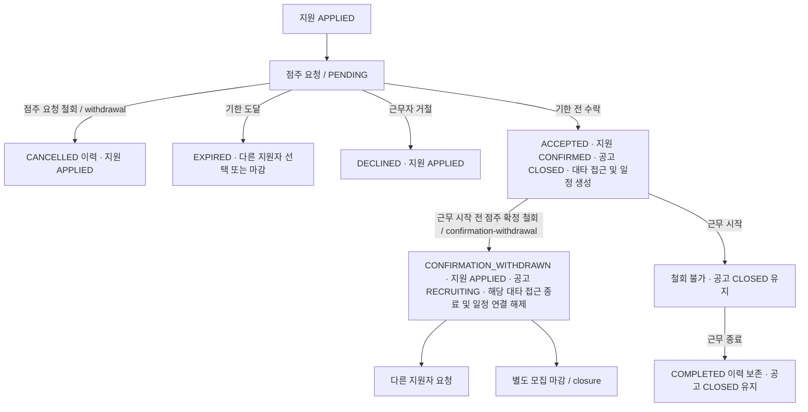

# 대타 근무 요청·확정·철회 계약

사용자가 첨부한 수정 디자인은 수락 대기 → 요청 철회하기, 미응답 → 지원자 선정 없이 모집 마감, 근무 확정 → 확정 철회하기로 구분합니다.

기한은 사용자 확정으로 `min(요청 시각 + 1시간, 근무 시작 시각)`을 유지합니다. 예를 들어 08:30 요청·09:00 근무이면 09:00 만료입니다. 기한과 같은 시각부터 EXPIRED로 판단하므로 배치 지연으로 수락 시간을 연장하지 않습니다.

요청 철회는 지원자의 신청 철회와 별개입니다. PENDING만 CANCELLED로 종료하고 신청은 APPLIED로 돌아갑니다. 확정 철회는 근무 시작 전의 현재 ACCEPTED 요청만 대상으로 합니다. 최초 수락 시각과 철회 시각을 모두 남기며 해당 요청의 TEMPORARY 접근만 REVOKED로 종료합니다. 정기 접근과 다른 대타 접근은 유지합니다. 취소 일정은 활성 월별 캘린더에 노출하지 않되 감사 이력은 보존합니다.

수락으로 NOT_SELECTED가 된 지원은 원인 requestId·직전 상태·ID를 기록하여 확정 철회 때 그 변경만 되돌립니다. WITHDRAWN이나 개별 종료된 지원을 복구하지 않습니다. 기존 요청을 재활성화하지 않고 새 요청 ID/key를 발급합니다.

수락과 동시에 공고는 RECRUITING→CLOSED, closedAt=respondedAt으로 전환됩니다. 거절은 공고를 마감하지 않습니다. 근무 시작 전 확정 철회는 CLOSED→RECRUITING, closedAt=null로 전환해 다시 모집합니다. 원래 수락·마감·철회 이력은 보존하고 공고 revision을 증가시킵니다. 근무 종료만으로 다시 열리지 않습니다.

수동 모집 마감은 미확정 모집 중 공고에 사용하며 유효 대기 요청이 있으면 WORK_REQUEST_WITHDRAWAL_REQUIRED입니다. 이미 CLOSED이면 최신 revision으로 200 현재 결과를 반환하고 시각·revision·확정·접근·일정 이력을 유지합니다. 각 변경은 공고 잠금과 revision으로 경합을 직렬화하고 접근·일정·알림 outbox까지 원자 처리하는 구현 계약입니다.

요청 생성 201 예시는 정상 1시간 기한과 시작 30분 전 요청(근무 시작 시 만료)을 구분합니다. 요청 상세의 실제 필드명은 expiresAt입니다.

확정 철회 시 해당 접근이 이미 수동 종료(REVOKED)되어 있었다면 최초 revokedAt을 보존합니다. 확정 철회 시각은 요청 endedAt에 별도로 저장하여 기존 접근 종료 이력을 덮어쓰지 않습니다. 근무자 본인의 신청 철회는 APPLIED/REQUESTED에만 적용하며 확정 철회는 점주 API입니다.
