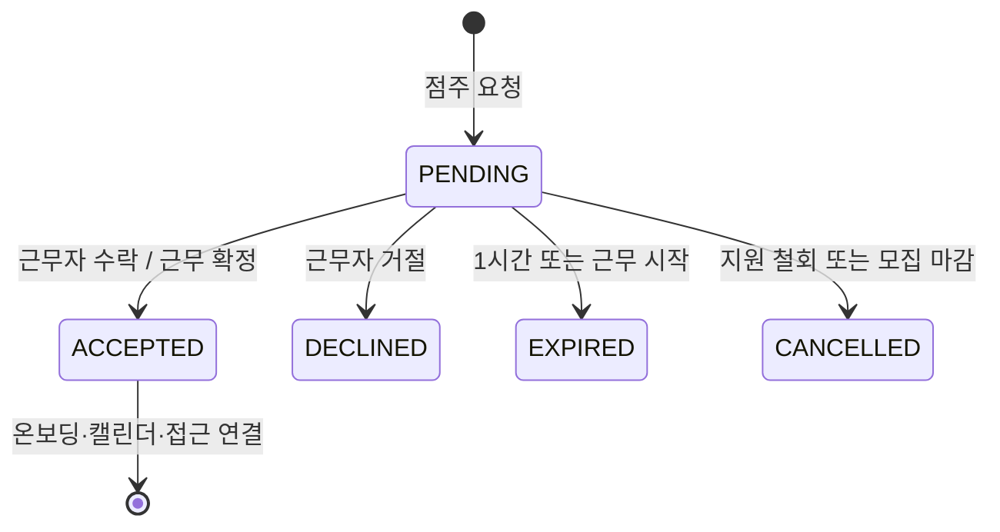

# 근무 요청·확정 계약

Figma의 요청 확인→수락 대기→1시간 미응답→다른 지원자→근무 확정→온보딩 보기를 연결합니다. 근무자의 요청 조회/응답은 화면에는 없지만 확정에 필요한 보완 API입니다.

현재 제안은 1시간(또는 근무 시작)까지 응답이 없으면 만료입니다. 기한 경계는 제외하고 동일 공고 잠금으로 수락/마감/철회/새 요청의 첫 성공만 반영합니다. 수락은 지원 확정·캘린더·자료 접근·알림 outbox와 원자 처리합니다. 대타 접근은 수락 즉시 시작하고 근무 종료에 끝나며 다른 정기 접근과 독립적입니다. 동시간 대타 중복 확정 차단은 제안 정책입니다.

## 점주 요청 철회

수락 대기의 요청 철회하기는 POST `work-requests/{requestId}/withdrawal`입니다. PENDING·기한 전·revision 일치일 때 CANCELLED로 종료하고 지원서는 APPLIED로 돌아갑니다. 수락과 철회는 같은 잠금으로 직렬화하며 ACCEPTED 요청은 이 API로 취소할 수 없습니다. 새 요청에는 새 ID/key를 사용하고 기존 이력을 보존합니다.
