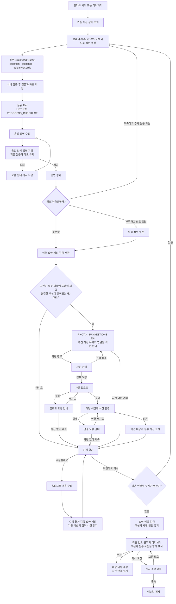

아래처럼 **Structured Output과 인터뷰 흐름을 하나의 설계 초안**으로 정리하면 좋겠습니다. 아직 파일이나 API 명세에는 반영하지 않고, 채팅에서 먼저 검토할 수 있도록 정리했습니다.

핵심은 **AI가 질문·카드 유형·내용을 함께 생성하고, 서버가 검증·저장·진행을 담당하는 구조**입니다. 별도 `InterviewSubject` 모델이나 화면 표현 계획은 추가하지 않습니다.

**1. 전체 처리 구조**

| <p>처리 단계</p> | <p>AI가 반환하는 내용</p> | <p>서버가 담당하는 내용</p> |
| - | - | - |
| 질문 생성 | 질문, 안내, 일반 목록 또는 진행 체크리스트 | 출력 검증, ID 부여, 질문·카드 저장 |
| 답변 평가 | 정보 충분성, 부족한 내용 | 추가 질문 여부와 한도 판단 |
| 이해 요약 | 짧은 요약, 근무조·업무·절차, 미확정 정보 | 참조 검증, 요약과 revision 저장 |
| 사진 추천 | 사진이 도움이 되는지, 추천 사진 목록 | 준비된 섹션 확인, 실제 첨부 대상 연결 |
| 음성 수정 | 수정된 요약과 콘텐츠 | 변경 검증, 기존 ID·사진 연결 유지 |
| 초안 생성 | 최종 매뉴얼 콘텐츠 | 버전 생성, 사진 연결 유지, 게시 조건 검증 |

녹음 시간·파일 선택 상태는 프론트가 관리합니다. 처리 상태·오류·revision·게시 여부는 AI 출력에 포함하지 않습니다.

**2. 질문 생성 Structured Output**

검토하기 쉽게 타입 형태로 표현했습니다. 실제 Structured Output 적용 시 각 타입을 JSON Schema로 정의합니다.

```
type QuestionOutput = {
  question: string;
  guidance: string | null;
  guidanceCards: QuestionCard[];
};

type QuestionCard = {
  type: "LIST" | "PROGRESS_CHECKLIST";
  title: string;
  items: {
    id: string | null;
    label: string;
    description: string | null;
    status:
      | "PENDING"
      | "CURRENT"
      | "COMPLETED"
      | "NEEDS_DETAIL"
      | null;
  }[];
  footer: string | null;
};
```

| <p>필드</p> | <p>의미</p> |
| - | - |
| `question` | 점주에게 할 질문 한 개 |
| `guidance` | 질문 아래에 표시할 답변 안내 |
| `guidanceCards` | 질문에 필요한 카드. 없으면 빈 배열 |
| `type` | 예시·설명 목록인지, 인터뷰 진행 체크리스트인지 |
| `items[].id` | 기존 항목이면 이전 ID 유지, 새 항목이면 `null` |
| `items[].status` | 진행 체크리스트에서만 사용. 일반 목록은 `null` |
| `footer` | 카드 하단의 보조 안내 |

`PHOTO_SUGGESTIONS`는 **요약 저장 후의 사진 추천 단계에서 생성**합니다. 질문 생성 출력에서는 제외하되, 프론트의 카드 렌더러는 세 유형을 모두 지원하면 됩니다.

예를 들어 점주가 재고 정리와 시재 점검을 실제 업무로 답했다면 다음처럼 받습니다.

```
{
  "question": "시재 점검은 어떤 순서로 하나요?",
  "guidance": "확인하는 시점과 금액이 맞지 않을 때의 처리 방법을 알려주세요.",
  "guidanceCards": [
    {
      "type": "PROGRESS_CHECKLIST",
      "title": "작성할 업무 매뉴얼",
      "items": [
        {
          "id": "기존-재고정리-ID",
          "label": "재고 정리",
          "description": null,
          "status": "COMPLETED"
        },
        {
          "id": "기존-시재점검-ID",
          "label": "시재 점검",
          "description": null,
          "status": "CURRENT"
        }
      ],
      "footer": null
    }
  ]
}
```

ID는 설명용 표기입니다. 서버는 새 항목에 ID를 부여하고, 다음 생성 요청에 직전 카드를 함께 전달합니다.

**진행 체크리스트의 의미**

| <p>상태</p> | <p>의미</p> |
| - | - |
| `PENDING` | 아직 확인하지 않은 항목 |
| `CURRENT` | 현재 질문에서 확인 중인 항목 |
| `COMPLETED` | 답변을 통해 필요한 내용이 확보된 항목 |
| `NEEDS_DETAIL` | 부족한 내용이 남은 채 확인을 마친 항목 |

체크리스트는 읽기 전용입니다. **점주가 체크해서 완료시키거나, 답변을 제출했다는 이유만으로 완료 처리하지 않습니다.**

AI가 누적 답변·평가 결과·직전 카드를 바탕으로 상태를 제안하고, 서버가 검증한 결과만 저장합니다. 일반 예시를 실제 매장 업무로 바꾸지 않아야 하며, 진행 카드와 `CURRENT`는 각각 최대 한 개입니다. 전체 목록을 묻는 질문은 `CURRENT`가 없어도 됩니다.

**3. 답변 평가와 이해 요약**

답변 평가는 기존 구조를 유지합니다.

```
type AnswerEvaluation = {
  sufficient: boolean;
  probability: number;
  missing_aspects: string[];
};
```

서버는 평가 결과와 기존 추가 질문 한도를 사용합니다.

- 충분하면 이해 요약을 생성합니다.

- 부족하고 추가 질문이 가능하면 부족한 내용을 묻습니다.

- 한도에 도달하면 부족 정보를 보존하고 이해 요약으로 넘어갑니다.

이해 요약은 화면용 설명과 실제 매뉴얼 콘텐츠를 함께 받습니다.

```
type ReviewOutput = {
  summary: string;
  structure: {
    shifts: Shift[];
    sections: Section[];
    missing_information: MissingInformation[];
  };
};
```

`Shift`, `Section`, `MissingInformation`은 기존 콘텐츠 구조를 재사용합니다.

| <p>화면</p> | <p>사용할 데이터</p> |
| - | - |
| 이해 확인의 짧은 설명 | `summary` |
| 근무조·시간 카드 | `shifts` |
| 업무·설비·규정 카드 | `sections` |
| 카드 안의 절차 | `sections[].steps` |
| 아직 확인되지 않은 내용 | `missing_information` |

이해 확인 카드의 체크 아이콘은 요약의 시각적 표현입니다. 인터뷰 진행 체크리스트나 매뉴얼 절차의 `checklistItem`과 구분합니다.

**4. 요약 저장 후 사진 추천 Structured Output**

저장된 요약과 섹션을 입력으로 받아 사진 추천을 판단합니다. 별도 `helpful` 값 없이 **추천이 없으면 빈 배열**로 표현하면 충분합니다.

```
type PhotoSuggestionOutput = {
  suggestions: {
    sectionId: string;
    title: string;
    items: {
      label: string;
      description: string | null;
    }[];
    footer: string | null;
  }[];
};
```

예시:

```
{
  "suggestions": [
    {
      "sectionId": "저장된-화장실이용-섹션-ID",
      "title": "첨부하면 도움이 되는 사진",
      "items": [
        {
          "label": "화장실 위치",
          "description": "처음 온 근무자가 찾을 수 있도록 입구가 보이게 찍어주세요."
        },
        {
          "label": "열쇠 보관 위치",
          "description": null
        }
      ],
      "footer": "사진 없이도 계속할 수 있어요."
    }
  ]
}
```

서버는 반환된 `sectionId`가 현재 저장된 요약에 존재하는지 확인한 뒤, 기존 API의 `PHOTO_SUGGESTIONS` 카드로 변환합니다.

```
AI 추천 결과
  → 섹션 존재·귀속 검증
  → 카드와 항목 ID 부여
  → type: PHOTO_SUGGESTIONS
  → attachmentTarget 연결
  → 프론트에 반환
```

각 카드는 하나의 섹션에 연결합니다. 서로 다른 섹션의 사진을 추천한다면 카드를 나눕니다.

Mermaid의 `[JEV]` 판단은 **AI의 사진 추천 결과와 서버의 섹션 준비 여부 검증을 합친 단계**입니다. 추천이 없거나 유효한 대상이 없으면 이해 확인으로 진행합니다. 사진 추천 생성이 실패해도 필수 인터뷰 진행을 막지 않습니다.

**5. 사진 첨부와 수정 규칙**

이 흐름의 사진은 **최종 매뉴얼에 표시하는 첨부 사진**입니다. #171의 AI 작성용 미디어 입력과는 구분합니다.

| <p>상황</p> | <p>처리</p> |
| - | - |
| 사진 선택 취소 | 추천 화면으로 복귀 |
| 업로드 실패 | 업로드 재시도 또는 사진 없이 계속 |
| 업로드 성공·연결 실패 | 기존 `mediaId`로 연결만 재시도 |
| 사진 없이 계속 | 이해 확인으로 진행. 이미 연결된 사진은 유지 |
| 음성으로 내용 수정 | 기존 섹션 ID와 첨부 사진 연결 유지 |
| 초안 생성 | 섹션과 사진 연결을 함께 이어받음 |
| 최종 검토·미리보기 | 동일한 초안의 섹션과 사진 표시 |

섹션 자체를 삭제하는 수정은 별도 처리 대상입니다. 삭제된 섹션의 사진을 다른 섹션에 임의로 옮기지 않습니다.

**6. 통합 Mermaid**

````
flowchart TD
    A["인터뷰 시작 또는 이어하기"] --> B["서버 상태와 질문·요약 조회"]
    B --> C{"먼저 표시할 이해 요약이 있는가?"}

    C -- 있음 --> R["이해 확인<br/>섹션 내용과 첨부 사진 표시"]
    C -- 없음 --> D["AI 입력 구성<br/>현재 주제·누적 답변·평가 결과·직전 카드"]

    D --> E["질문 Structured Output<br/>question · guidance · guidanceCards"]
    E --> F{"출력 검증"}

    F -- 정상 --> G["ID 부여 후 질문과 카드 저장"]
    F -- 카드만 오류 --> H["잘못된 카드 제외 후 저장"]
    F -- 질문 오류 --> I["제한된 재시도 또는 기본 질문"]
    I --> G

    G --> J{"카드 유형"}
    H --> J
    J -- LIST --> K["질문과 일반 목록 표시"]
    J -- PROGRESS_CHECKLIST --> L["질문과 읽기 전용 진행 목록 표시"]
    J -- 카드 없음 --> M["질문과 안내 표시"]

    K --> N["음성 답변"]
    L --> N
    M --> N

    N --> O["음성 인식·답변 저장<br/>기존 질문과 카드 유지"]
    O -- 실패 --> OE["오류 오버레이<br/>재시도 또는 다시 녹음"]
    OE --> N
    O -- 성공 --> Q["답변 평가"]

    Q --> Q1{"정보가 충분한가?[JEV]"}
    Q1 -- 부족하고 추가 질문 가능 --> D
    Q1 -- 부족하고 한도 도달 --> Q2["부족 정보 보존"]
    Q1 -- 충분함 --> S["이해 요약 Structured Output"]
    Q2 --> S

    S --> S1["요약과 구조화 콘텐츠 검증·저장"]
    S1 --> P{"사진이 업무 이해에 도움이 되고<br/>연결할 섹션이 준비됐는가? [JEV]"}

    P -- 아니요 --> R
    P -- 예 --> P1["PHOTO_SUGGESTIONS 표시<br/>추천 사진 목록과 연결할 섹션 안내"]

    P1 -- 사진 첨부 --> P2["사진 선택"]
    P2 -- 선택 취소 --> P1
    P2 -- 첨부 요청 --> P3["사진 업로드"]

    P3 -- 성공 --> P4["해당 섹션에 사진 연결"]
    P3 -- 실패 --> P5["업로드 오류 안내"]
    P5 -- 재시도 --> P3
    P5 -- 사진 없이 계속 --> R

    P4 -- 성공 --> P6["섹션 내용과 첨부 사진 표시"]
    P4 -- 실패 --> P7["연결 오류 안내"]
    P7 -- 연결 재시도 --> P4
    P7 -- 사진 없이 계속 --> R

    P1 -- 사진 없이 계속 --> R
    P6 --> R

    R -- 수정할게요 --> T["음성으로 내용 수정"]
    T --> T1["수정 결과 검증·요약 저장<br/>기존 첨부 사진 유지"]
    T1 --> R

    R -- 확인하고 계속 --> U{"남은 인터뷰 주제가 있는가?"}
    U -- 있음 --> D
    U -- 없음 --> V["모든 요약 준비·revision 일치 확인"]

    V --> W["초안 생성·검증<br/>섹션과 사진 연결 유지"]
    W --> X["최종 검토·근무자 미리보기<br/>섹션과 첨부 사진 함께 표시"]
    X -- 수정 --> X1["대상 내용 수정<br/>기존 사진 연결 유지"]
    X1 --> X
    X -- 게시 요청 --> Y{"게시 조건·부족 항목 확인"}
    Y -- 보완 필요 --> X
    Y -- 충족 --> Z["매뉴얼 게시"]
```

서버가 다음 질문을 미리 생성해도, 화면에서는 아직 보여주지 않은 이해 요약을 먼저 표시합니다. 질문 생성 시점과 화면 표시 순서는 분리합니다.

검토 포인트는 **질문 카드 두 종류**, **요약 저장 후 별도 사진 추천**, **사진을 최종 매뉴얼까지 유지하는 흐름**입니다. 이 구성과 필드 수준으로 확정해도 될까요?
````


